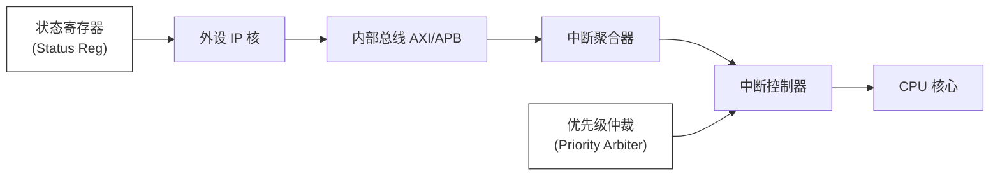

# 中断到底是怎么“打断”CPU的？

> 《路科验证》微信公众号

中断不是简单的“函数调用”，而是一套涉及信号同步、总线仲裁、特权级切换、上下文保护的精密硬件机制。理解这条链路上的每个环节，是排查“丢中断”、“响应延迟”、“嵌套异常”等疑难杂症的唯一途径

## 从物理信号开始：中断的电气本质

### 中断信号的硬件形态

在芯片内部，中断最初只是一个点评变化

| **触发方式**               | **电气特性**          | **典型应用**                    |
| -------------------------- | --------------------- | ------------------------------- |
| 电平触发 (Level-sensitive) | 持续高/低电平期间有效 | UART RX FIFO 非空、DMA 完成     |
| 边沿触发 (Edge-triggered)  | 上升沿/下降沿瞬间有效 | GPIO 按键、外部脉冲、定时器溢出 |
| 脉冲触发 (Pulse-triggered) | 特定宽度脉冲          | 高速同步信号、时钟丢失检测      |

> [!IMPORTANT]
>
> 边沿触发需要同步器（Synchronizer）处理跨时钟域（CDC）问题。如果外设时钟与CPU时钟异步，裸边沿可能因亚稳态（Metastability）丢失。这就是为什么高性能SoC会在GPIO控制器内部集成双触发器同步链

### 中断线的物理连接

现代SoC的中断连接并非“一根线直达CPU”：

flowchart LR
    A[外设 IP 核] --> B[内部总线<br/>(AXI/APB)] --> C[中断聚合器] --> D[中断控制器] --> E[CPU 核心]



# 中断的三种触发方式

电平触发、边沿触发和脉冲触发，是CPU响应外部中断请求的三种不同“触发方式”。它们的核心区别在于**CPU如何识别一个有效的中断请求**，这直接影响了中断的**响应时机、可靠性以及应用场景**

| 特性         | 电平触发 (Level-Triggered)                     | 边沿触发 (Edge-Triggered)                        | 脉冲触发 (Pulse-Triggered)                       |
| :----------- | :--------------------------------------------- | :----------------------------------------------- | :----------------------------------------------- |
| **触发条件** | 检测到中断引脚上持续的**有效电平**（高或低）   | 检测到中断引脚上电平的**跳变沿**（上升或下降）   | 检测到一个**持续至少一个时钟周期的有效电平信号** |
| **信号保持** | 请求信号必须**保持**，直到CPU处理完并清除      | 请求信号可以是一个**短暂的脉冲**，触发后即可释放 | 请求信号必须**至少维持一个时钟周期**             |
| **响应次数** | 只要有效电平**持续存在**，中断可能**反复触发** | 每个有效的**跳变沿**只触发**一次**               | 每个有效的**脉冲**只触发**一次**                 |
| **常见场景** | 按键输入、需要持续注意的状态信号               | 外部时钟同步、精确计数、位置传感器               | ARM Cortex-M处理器（如NVIC）中的标准中断方式     |

## 电平触发（level-triggered）

- 工作原理：CPU在每个机器周期都会去采样中断引脚的电平。只要检测到是有效的电平，就认为有中断请求
- 关键特性：
  - 持续性：中断源必须保持有效电平，直到CPU进入中断服务程序（ISR）并将其清除
  - 易重复触发：如果在ISR返回前，中断源没有撤销请求信号，那么CPU会再次响应该中断，可能导致“中断重入”
- 优点和缺点：
  - 优点：实现简单；只要电平存在，CPU就不会错误请求
  - 缺点：中断服务程序必须负责清除中断源，否则会导致死循环；不适合多个设备共享一条中断线的情况

## 边沿触发（Edge-Triggered）

- 工作原理：CPU检测中断引脚上电平的变化（从高到低或从低到高）。一旦检测到指定的跳变，就立即锁存中断请求
- 关键特性：
  - 瞬时性：中断请求可以是一个很短的脉冲，触发后设备即可释放中断线
  - 单次响应：一个有效的跳变沿只会触发一次中断，即使电平继续保持就不会再次触发
- 优点与缺点：
  - 优点：响应速度快，能捕捉到很窄的脉冲；非常适合多个设备共享中断线
  - 缺点：如果脉冲太窄，CPU可能采样不到而丢失中断；若中断被暂时屏蔽，期间发生的边沿事件可能会被遗漏

## 脉冲触发 （pulse-triggered）

- 工作原理：这是边沿触发的一种特例或实现方式。CPU要求在时钟的上升沿同步采样中断信号
- 关键特点：
  - 宽度要求：为了确保被可靠检测，中断信号必须维持至少一个完整的时钟周期
  - 硬件锁存：NVIC（前台向量中断控制器）等硬件会锁存这个脉冲请求，确保CPU不会错过
- 优点与缺点：
  - 结合了边沿触发的“单次”和电平触发的“可靠”优点，抗噪性强，时序确定
  - 缺点：对中断源有严格的时序要求（脉冲宽度）。实现略复杂

## 如何选择

- 如果中断源信号是持续的电平状态（如按键），且你能在ISR中清除它，电平触发更合适
- 如果中断源只产生一个短暂的脉冲（如编码器信号），或者需要多个设备共享中断线，那么边沿触发更好
- 在现代ARM Cortex-M等处理器中，脉冲触发是标准且推荐的方式，因为它提供了很好的可靠性和确定性

# 中断中改变的变量要加volatile修饰

> 《芯片验证全视角经验心得分享》微信公众号
>
> [为什么中断中改变的变量要加volatile修饰](https://mp.weixin.qq.com/s?__biz=MzUzMzM1MTcwNQ==&mid=2247485320&idx=1&sn=9acd736bd172450cd0215f7950b5cae0&chksm=fbfa0d45b2e753879471e7a651e21b088ed1e6c8a1d3a6860f621648284a73320e7eabb18da1&mpshare=1&scene=1&srcid=0719p7KwQOndnfSB8v6PUkWD&sharer_shareinfo=6257ccceb014010a5e31796bc10b71b3&sharer_shareinfo_first=6257ccceb014010a5e31796bc10b71b3#rd)

为了防止编译器进行“过度优化”,从而生成错误的代码，导致程序无法读取到变量在中断中的最新值

## 1. 核心问题：编译器的视角局限性

- 编译器在将你的C代码翻译成机器码时，会进行各种优化来让代码跑得更快、体积更小。其中一种常见的优化叫做**“冗余加载消除”**
- 编译器在分析你的`main`函数（或任何非中断函数）时，它不知道也无法感知这个变量会被一个异步发生的中断服务程序（ISR）修改。在它看来，这个变量的值只能被当前的执行流改变

## 2. volatile关键字的作用

volatile关键字就是用来告诉编译器：“这个变量是易变的，它的值可能会被当前代码之外的代理改变（比如中断、硬件寄存器、另一个线程），你不能对它做任何假设性的优化”

具体含义：

- 禁止编译器将变量缓存在寄存器中，每次使用都必须老老实实地从内存中重新读取
- 防止编译器调整指令顺序，确保对volatile变量的操作顺序在生成的汇编代码中得到严格保持

## 3. 总结

在嵌入式编程中，你必须在以下情况使用volatile:

1. 在中断服务程序ISR和主程序（或非ISR任务）之间共享的变量

2. 在多线程（或RTOS任务）之间共享的变量（虽然对于多线程，通常还需要更强的同步机制如互斥锁，但volatile是基础要求）

3. 映射到内存的硬件寄存器，如：

   ```c
   🔴🟠🟢
   #define GPIO_DATA (*(volatile unsigned int *)0x40000000)
   ```

   这个指针指向一个硬件地址，其值会由硬件外设（如引脚电平）改变，编译器绝不能优化对它的访问

> [!IMPORTANT]
>
> 如果对程序文件大小不敏感，建议无论是debug版本便宜和release版本编译，都将编译器的优化等级设置为最低，即不进行任何优化

---

# RISC-V 中断trap

在 RISC-V 架构中，将中断和异常统称为**陷入（Trap）**，即程序在正常执行过程中的强制转移。我们先来看一看在 RISC-V CPU 内部是如何检测中断的。在 CPU 内部，会有中断的处理电路。如果在运算时发生了异常的情况，比如出现除法错误，运算器就会产生相应的中断信号。如果遇到其他指令产生的中断，就会产生其他对应的控制信号。这些中断和正在运行的程序本身有关，属于**内部中断**或**异常**，例如执行 `ecall` 指令触发的系统调用。

还有来自 CPU 外部的中断。这些外设有可能是键盘、网络、打印机等等。当键盘按键，或者有收发网络包的情况，这些外设的芯片或者板卡就会通过中断控制器（如 PLIC，平台级中断控制器）发出中断请求信号。这些信号最终都会连接到 CPU 内部。不管来源是哪里，CPU 检测到了中断请求信号，就会进行处理。

## 中断处理过程

RISC-V 的中断处理过程与 x86 有显著不同。**RISC-V 架构在进入和退出中断处理模式时，没有硬件自动保存和恢复上下文（通用寄存器）的操作**，因此需要软件明确地使用汇编指令进行上下文的保存和恢复。

整体流程如下（以机器模式 M-Mode 为例）：

> 注：上述以 M 模式（机器模式）为例。如果使用 S 模式（内核态/监督模式），对应的寄存器为 `sepc`、`scause`、`stvec`、`sstatus`，返回指令为 `sret`。

### 1. 硬件自动执行的操作

当 RISC-V CPU 检测到中断或异常时，硬件会自动完成以下操作：

- **保存返回地址**：将当前 PC 寄存器的值保存到 `mepc`（Machine Exception Program Counter）寄存器中。RISC-V 指令不定长，如果中断处理需要恢复到异常指令后一条指令执行，就需要正确判断将 PC 加上多少字节。
  - 对于exception,mepc指向导致异常的指令；对于interrupt,它指向被中断的指令的下一条指令的位置
- **保存中断使能状态&&关闭中断响应**：将 `mstatus` 中的 MIE（Machine Interrupt Enable）位保存到 MPIE（Machine Previous Interrupt Enable）位中；清除 `mstatus.MIE` 位，屏蔽后续中断。
- **记录中断原因**：将中断原因和来源写入 `mcause`（Machine Cause Register）寄存器。`mcause` 的最高位表示是中断还是异常，低 31 位是具体原因编码（如 0x0B 表示外部中断）。
  - 根据需要为mtval设置附加信息
- **保存特权模式**：将trap发生之前的特权模式保存在mstatus的MPP域中，再把hart权限模式更改为M（也就是说无论在任何level下触发trap，hart首先切换到machine模式）
- **跳转到入口地址**：根据 `mtvec`（Machine Trap Vector Base Address Register）寄存器设置的入口地址，将 PC 设置为该地址。
  - RISC-V 的 `mtvec` 寄存器支持两种模式：
    - **直接模式（Direct Mode，MODE=0）** ：所有中断和异常都跳转到同一个入口地址 `mtvec.BASE`
    - **向量模式（Vectored Mode，MODE=1）** ：中断跳转到 `mtvec.BASE + 4 × cause`，不同中断类型有不同的入口；异常仍使用统一入口

> **注意**：与 x86 不同，RISC-V 硬件**不会自动保存任何通用寄存器**（如 x1–x31）。这些寄存器的保存和恢复完全由软件负责。

### 2. 软件保存现场（保护上下文）

由于硬件不会自动保存通用寄存器，中断服务程序的第一步必须由软件（通常是汇编代码）保存当前程序的**上下文**：

- 将中断服务程序中要使用的通用寄存器（如 ra、sp、gp、tp、t0–t6、s0–s1、a0–a7 等）压入堆栈。
- 保存其他需要保护的 CSR 寄存器。

### 3. 执行中断服务程序

转到中断服务程序入口开始执行。在服务程序中，可以在适当时刻重新开放中断，以便允许响应较高优先级的外部中断。

**如何重新开放中断？**

RISC-V 通过 `mstatus` 寄存器中的 **MIE（Machine Interrupt Enable）** 位控制全局中断使能：

- 若 MIE = 1，允许 CPU 响应可屏蔽中断请求
- 若 MIE = 0，不允许 CPU 响应可屏蔽中断请求

此外，`mie`（Machine Interrupt Enable）寄存器还可以控制**具体类型**中断的使能，例如：

- **MEIE**（Machine External Interrupt Enable）：控制外部中断
- **MTIE**（Machine Timer Interrupt Enable）：控制时钟中断
- **MSIE**（Machine Software Interrupt Enable）：控制软件中断

仅当 `mstatus.MIE` 和 `mie` 中对应的位都为 1 时，中断才会最终触发。

软件可以通过 CSR 读写指令修改这些位：

- `csrrsi` 或 `csrrs` — 将 MIE 置 1（开中断）
- `csrrci` 或 `csrrc` — 将 MIE 清 0（关中断）

### 4. 恢复现场并返回

把"保存现场"时压入堆栈的信息弹回原寄存器，然后执行中断返回指令，从而返回主程序继续运行（从中断服务程序返回，mepc的值可能需要调整）。

#### MRET 指令（机器模式中断返回）

- **格式**：`mret`
- **操作**：
  1. 将 PC 设置为 `mepc` 寄存器中保存的地址
  2. 将 `mstatus.MPIE` 恢复到 `mstatus.MIE`（mstatus.MPIE  =1）
  3. 将特权模式恢复为 `mstatus.MPP` 中保存的模式。mstatus.MPP = U(如果hart不支持U，则为M)
- **说明**：
  - 放在中断服务程序的末尾
  - 按中断调用时的逆序恢复现场（软件负责恢复通用寄存器）
  - 返回到程序发生中断处继续执行

> 扩展：`SRET` 指令用于从 S 模式（内核态）的陷阱返回 

## 总结

这就是 RISC-V 中断（陷入）处理过程的主要步骤。与 x86 架构的关键区别在于：

| 特性         | x86                  | RISC-V                       |
| ------------ | -------------------- | ---------------------------- |
| 上下文保存   | 硬件自动压栈         | **软件负责保存**通用寄存器   |
| 返回地址保存 | 压入堆栈             | 保存到 `mepc`/`sepc` 寄存器  |
| 中断入口     | 中断向量表（IDT）    | `mtvec`/`stvec` 寄存器       |
| 中断返回     | `IRET`（从栈中弹出） | `MRET`/`SRET`（从 CSR 恢复） |
| 中断使能     | EFLAGS.IF            | `mstatus.MIE`/`sstatus.SIE`  |

RISC-V 的设计理念是**简化硬件、将更多工作交给软件**，这使得中断处理更加灵活，但也要求中断服务程序必须正确地保存和恢复上下文。在设计 RISC-V 的中断服务程序时，必须清楚地知道哪些工作由硬件完成、哪些由软件完成，否则就可能发生错误。


