[TOC]


# 1. 导论

1. CHI ： Coherent Hub Interface的缩写

2. CHI是ACE的演进，ACE是AXI的一致性扩展，CHI是下一代带一致性的SoC互连协议

3. 应用场景：移动、网络、汽车、数据中心——都是需要多个处理器或加速器核心保持数据一致的场景

4. 设计目标：在租金啊数量和流量持续增长时，仍能维持高性能

   > [!IMPORTANT]
   >
   > - 习惯使用`requester`和`subordinate`代替Master/Slave
   > - requester是事务发起的一方，subordinate是响应事务的一方，在CHI中，一个组件可以同时是requester和subordinate


# 2. 简介

## 2.1 网络拓扑

1. CHI协议定义了CHI网络的不同组件，但不规定你用什么方式把组件连起来。这给了芯片设计师巨大的灵活性，可以根据性能、功耗和面积来选拓扑

2. 三种拓扑结构

   | 拓扑                    | 连接方式                             | 优点               | 缺点                 | 适合规模 |
   | ----------------------- | ------------------------------------ | ------------------ | -------------------- | -------- |
   | **环形 (Ring)**         | 每个组件只连左右两个邻居，形成闭环   | 连线少，面积小     | 延迟随节点数线性增长 | 中型     |
   | **网格 (Mesh)**         | 每个组件连上下左右邻居，形成二维网格 | 路径多，带宽高     | 面积成本高           | 大型     |
   | **交叉开关 (Crossbar)** | 每个组件都与其他所有组件直接相连     | 性能最好，延迟最低 | 连线极多，面积最大   | 小型     |

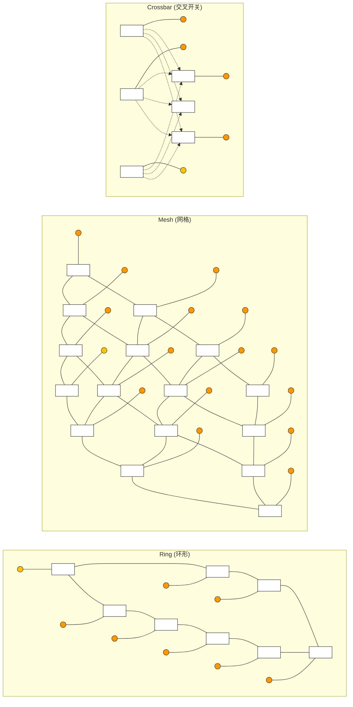

> [!NOTE]
>
> 圆圈是Requester/Subordinate组件，方块是路由中间节点

## 2.2 CHI协议迭代

1. CHI协议从A到G不断演进，但**每个新版本都和旧版本物理上不兼容**（因为flit字段宽度变了）

| 版本      | 定位         | 关键新增功能                                                 | 兼容性                       |
| --------- | ------------ | ------------------------------------------------------------ | ---------------------------- |
| **CHI-A** | 首个基础版本 | 定义通道、术语、基本读写流程、Snoop机制、DVM操作             | -                            |
| **CHI-B** | 重大功能扩展 | **DMT/DCT**（数据绕过HN直传）、原子事务、VMID扩展、RAS特性、更大物理地址宽度 | 不与A兼容                    |
| **CHI-C** | 小幅扩展     | **分离响应与数据**（RespSepData/DataSepResp）、**NCBWrDataCompAck**（写数据+CompAck合并）、减少事务生命周期 | 不与B兼容（Data通道宽+1bit） |
| **CHI-D** | 小幅更新     | **Armv8.4 MPAM**支持、TxnID扩展到10位、Endpoint Order不再隐含Request Order、可选奇偶校验保护 | 不与C兼容                    |
| **CHI-E** | 重大功能扩展 | **MTE**（内存标记扩展）、**Direct Write Transfer**（DWT）、TxnID扩展到12位、写零无数据传输、组合写+CMO、范围TLB无效化 | 不与D兼容                    |
| **CHI-F** | 小幅更新     | **RME**（领域管理扩展）、**CopyAtHome**（CAH）属性、MTE更新、可延迟写入（WriteNoSnpDef）、PBHA字段 | 不与E兼容                    |
| **CHI-G** | 小幅更新     | **Limited Data Elision**（减少冗余数据传输）、**MEC**（内存加密上下文）、PrefetchTgtHint、MTE_Support属性 | 不与F兼容                    |

> [!NOTE]
>
> - **B、E是“大版本”**：引入了DMT/DCT（B）和MTE/DWT/Range-TLBI（E），功能变化大。
> - **C、D、F、G是“小版本”**：主要是性能优化和架构对齐（MPAM、RME、MEC）。
> - **为什么不兼容？** 因为每个版本都修改了Flit的字段宽度。比如C的Data通道比B多1 bit，D的所有通道宽度都有变化。所以**CHI-B的IP不能直接连CHI-C的互连**

# 3. 协议基础

主要是四个核心模块：节点类型、缓存行状态、flit与信道、系统地址映射

## 3.1 节点类型（Node）

### 3.1.1 3 + 1

| 节点类型 | 全称               | 一句话角色             | 现实类比                             | 描述                                                         |
| -------- | ------------------ | ---------------------- | ------------------------------------ | ------------------------------------------------------------ |
| **RN**   | Request Node       | 发起请求的“买家”       | 顾客去超市买东西                     | 比如读写请求，这些事务发给HN                                 |
| **HN**   | Home Node          | 管理一致性的“超市店长” | 店长知道每件商品（缓存行）被谁借走了 | 负责对请求进行排序，生成事务发给SN；发送snoop或者处理DVM操作 |
| **SN**   | Subordinate Node   | 最终存储的“仓库”       | 超市后方的总仓库（内存）             | -                                                            |
| **MN**   | Miscellaneous Node | 处理DVM操作的“广播员”  | 店长通知所有顾客“商品标签换了”       | -                                                            |

3.1.1 节点细分： F vs I vs D

RN的三种子类型:

| 子类型   | 有缓存？ | 接受Snoop？ | 接受DVM？ | 典型是谁？                |
| -------- | -------- | ----------- | --------- | ------------------------- |
| **RN-F** | ✅ 有     | ✅ 接受      | ✅         | CPU核心（如Cortex-A系列） |
| **RN-I** | ❌ 无     | ❌ 不接受    | ❌         | DMA引擎、网卡             |
| **RN-D** | ❌ 无     | ❌ 不接受    | ✅ 接受    | 支持虚拟化的网卡          |

HN的三种子类型：

| 子类型         | 负责什么内存区域        | 能发Snoop？ |
| -------------- | ----------------------- | ----------- |
| **HN-F**       | 一致性内存空间          | ✅ 能        |
| **HN-I**       | I/O子系统（非一致性）   | ❌ 不能      |
| **HN-D（MN）** | 处理RN节点发送的DVM事务 | ❌ 不能      |

SN的三种子类型：

| 子类型   | 背后是什么                    |
| -------- | ----------------------------- |
| **SN-F** | 一致性内存设备（如DDR控制器） |
| **SN-I** | I/O外设或非一致性内存         |

**RN-F、RN-I、RN-D、HN-F、HN-I、SN-F、MN各是什么角色**

| 节点类型 | 角色定位                     | 关键特征                                                     |
| -------- | ---------------------------- | ------------------------------------------------------------ |
| **RN-F** | 完全一致性请求节点           | 包含硬件一致性cache，可产生所有协议定义的transactions，支持所有snoop transactions |
| **RN-D** | I/O一致性请求节点（支持DVM） | 不包含硬件一致性cache，可接收DVM操作，通常配合SMMU使用       |
| **RN-I** | I/O一致性请求节点（基本）    | 不包含硬件一致性cache，不能接收DVM操作，不要求具有snoop功能  |
| **HN-F** | 完全一致性Home节点           | 包含目录或snoop filter来管理所有RN-F的cache一致性，是PoC点和PoS点 |
| **HN-I** | I/O Home节点                 | 处理有限部分request，管理访问IO subsystem的顺序，不处理snoop |
| **SN-F** | 完全功能从节点               | 接收来自HN的请求，连接最终存储（如DDR控制器）                |
| **MN**   | 杂项节点                     | 专门用于接收并处理DVM操作，完成操作后返回响应                |

## 3.2 缓存行状态(cacheline status)

如果说节点是CHI的骨架，那么**缓存行状态（Cache Line States）**就是CHI的血液。每个缓存行在系统中都有“身份”，这个身份决定了它可以被谁修改、谁来负责写回

### 3.2.1 三个维度的组合

CHI用三个维度来定义一个缓存行的状态

- **Valid / Invalid**：这行数据是否存在于缓存中？
- **Unique / Shared**：这行数据只在一个缓存里，还是可能多个缓存都有？
  - **只有当本地缓存行处于唯一状态时，才能对其进行存储。**

- **Clean / Dirty**：缓存里的数据和内存是否一致？如果不一致（Dirty），谁来负责把它写回内存？
  - **Clean means that the caches is not responsible for updating Main Memory.**The cache line can still hold a different value to Main Memory as a result of a previous update in another cache.
  - Dirty means that the cache  line  has been **modified with respect to Main Memory**. When this line is **evicted** from this cache,the requester must **ensure either that Main Memory is updated**,or that the **Dirty responsibility** is passed to another component in the system.


此外，CHI还引入了**Full / Partial / Empty**来描述数据的字节有效性(相比ACE的不同点)

- **Full**：全部字节有效
- **Partial**：部分字节有效（0~全部都有可能）——状态是Partial，但内容可能还没有全部写入
  - A Partial cache line can have some bytes valid,which include none or all bytes. **This is because the state is updated but valid bytes have not been written yet,or because all bytes have been written but the state has not been updated.** **There are additional restrictions to the responses that can be given when a line in this state is snooped.**

- **Empty**：没有有效字节，但所有权还在这个缓存
  - An empty cache line has no Valid bytes of data , **but the ownership of the line still belongs to a requester**


### 3.2.2 七种缓存行状态

| 状态                      | 缩写 | 是否存在 | 独占/共享 | 是否脏 | 特殊 | MOESI对比     |
| ------------------------- | ---- | -------- | --------- | ------ | ---- | ------------- |
| ①**Invalid**              | I    | ❌        | -         | -      | -    | **I**nvalid   |
| ②**Unique Clean**         | UC   | ✅        | 独占      | 干净   | -    | **E**xclusive |
| ③**Unique Clean Empty**   | UCE  | ✅        | 独占      | 干净   | 空   | （CHI新增）   |
| ④**Unique Dirty**         | UD   | ✅        | 独占      | 脏     | -    | **M**odified  |
| ⑤**Unique Dirty Partial** | UDP  | ✅        | 独占      | 脏     | 部分 | （CHI新增）   |
| ⑥**Shared Clean**         | SC   | ✅        | 共享      | 干净   | -    | **S**hared    |
| ⑦**Shared Dirty**         | SD   | ✅        | 共享      | 脏     | -    | **O**wned     |

> [!IMPORTANT]
>
> **新增状态的妙用**：
>
> - **UCE (Unique Clean Empty)**：CPU准备要写一大块内存，先把这个缓存行“抢过来”（变成Unique），但还没往里写数据。这样后续写的时候不用通知其他缓存，省时间。不占数据空间，只占状态。
> - **UDP (Unique Dirty Partial)**：CPU只写了一个缓存行的一部分字节（比如只写32字节中的8字节）。如果这时要把数据合并到别处，可以把这个“半成品”移交给更靠近内存的层级去完成合并，减少数据搬运
> - UDP态获得的前提是当前cacheline为UCE态，然后requester对其进行partial写，就产生了UDP态

各状态在收到snoop时的行为差异：

| 状态    | 是否可不知会他人就修改 | 收到Snoop时是否必须返回数据给HN | 收到Snoop时是否可fwd数据给Requester |
| ------- | ---------------------- | ------------------------------- | ----------------------------------- |
| **UC**  | ✅ 可以                 | 允许但不要求                    | 允许但不要求                        |
| **UCE** | ✅ 可以                 | ❌ 必须不能返回数据              | ❌ 必须不能fwd数据                   |
| **UD**  | ✅ 可以                 | ✅ 必须返回数据                  | ✅ 必须能fwd数据                     |
| **UDP** | ✅ 可以                 | ✅ 必须返回数据给HN              | ❌ 不能直接将数据fwd给Requester      |
| **SC**  | ❌                      | —                               | —                                   |
| **SD**  | ❌                      | 负责写回                        | —                                   |

**1. Invalid**

The cache line is **not present** in the cache.

**2. Unique Dirty**

This cache line only exists in this cache only and **is modified** with respect to Main Memory.In this state the requester can perform  a **write to the cache line**, because the line is already in a Unique state. If a snoop instructs it , the cache line must be **forwarded to the Requester**.

**3. Unique Dirty Partial**

This cache line exists in this cache only and is considered modified with respect to Main Memory.It can have some bytes valid,where some includes none or all bytes. In this state, the requester can perform a write to the cache line because the line is already in a Unique stats.In response to a snoop,the cache line **cannot be forwarded directly to the original requester**,even when instructed to by the snoop.

**4. Shared Dirty**

This cache line has been modified with respect to main memory,and this particular cache has the **responsibility to update main memory**.Because the cache line is Shared,it might exist in one or more local caches,but this is not guaranteed. If the line is present in multiple caches,these caches will have this line in Shared Clean.

**5. Unique Clean**

The cache line has not been modified with respect to Main Memory,and only exists in a single local cache.It can be modified without notifying other caches.

**6. Unique Clean Empty**

The cache line is present only in this cache,but none of the bytes are valid.The cache line can be modified without notifying other caches.If a snoop requests the line,**the line must not be returned to a Home Node or fowarded directly to the original requester.**

**7. Shared Clean**

The cache line might be held in one or more local caches. The line might have been modified with respect to Main Memory,but this cache is **not responsible for writing the line back to memory on eviction**.

### 3.2.3 状态转移图

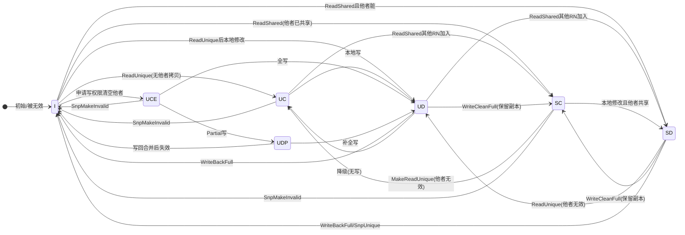


## 3.3 Flit与信道(消息如何传递)

### 3.3.1 什么是Flit

Flit是**Flow Control Unit**的缩写，是CHI协议的最小通信单元。你可以把它理解为一封“快递包裹”：

- Flit 中的字段不会像 PCIe 或以太网协议中的字段那样被拆分到多个数据包中发送。相反，它们是并行发送的
- 不同信道的Flit装的信息不同：Request Flit装地址和Opcode，Data Flit装数据和Byte Enable
- 每个Flit都带有**SrcID**（发件人ID）和**TxnID**（快递单号）

### **3.3.2 Request Flit**

<div style="display: flex; flex-direction: column; align-items: center; padding: 10px; width: 160px; font-family: -apple-system, sans-serif;">
    <div style="font-weight: bold; margin-bottom: 12px; color: #333;">LPID:Example CPU Cluster</div>
    <div style="background: #ffc107; border: 2px solid #333; padding: 6px 12px; width: 100px; text-align: center; margin-bottom: 6px; font-weight: bold;">CPU0<br><span style="font-weight: normal;">00000</span></div>
    <div style="background: #ffc107; border: 2px solid #333; padding: 6px 12px; width: 100px; text-align: center; margin-bottom: 6px; font-weight: bold;">CPU1<br><span style="font-weight: normal;">00001</span></div>
    <div style="background: #ffc107; border: 2px solid #333; padding: 6px 12px; width: 100px; text-align: center; margin-bottom: 6px; font-weight: bold;">CPU2<br><span style="font-weight: normal;">00010</span></div>
    <div style="background: #ffc107; border: 2px solid #333; padding: 6px 12px; width: 100px; text-align: center; margin-bottom: 6px; font-weight: bold;">CPU3<br><span style="font-weight: normal;">00011</span></div>
</div>

<div style="padding: 10px; font-family: -apple-system, sans-serif;">
    <table style="border-collapse: collapse; width: 100%; max-width: 350px; font-size: 14px; border: 2px solid #2c3e50;">
        <thead>
            <tr style="background: #ff7f00; color: white;">
                <th style="border: 1px solid #333; padding: 6px; width: 30px; text-align: center; font-size: 20px; color: #2c3e50;">◀</th>
                <th style="border: 1px solid #333; padding: 6px;">Opcode</th>
                <th style="border: 1px solid #333; padding: 6px;">Request Command</th>
            </tr>
        </thead>
        <tbody>
            <tr><td style="border: 1px solid #333; padding: 6px; text-align: center;"></td><td style="border: 1px solid #333; padding: 6px; text-align: center; font-weight: bold;">0x02</td><td style="border: 1px solid #333; padding: 6px;">ReadClean</td></tr>
            <tr><td style="border: 1px solid #333; padding: 6px; text-align: center;"></td><td style="border: 1px solid #333; padding: 6px; text-align: center; font-weight: bold;">0x03</td><td style="border: 1px solid #333; padding: 6px;">ReadOnce</td></tr>
            <tr><td style="border: 1px solid #333; padding: 6px; text-align: center;"></td><td style="border: 1px solid #333; padding: 6px; text-align: center; font-weight: bold;">0x04</td><td style="border: 1px solid #333; padding: 6px;">ReadNoSnp</td></tr>
            <tr><td colspan="3" style="background: #2c3e50; height: 10px; border: 1px solid #333; padding: 0;"></td></tr>
        <tr><td style="border: 1px solid #333; padding: 6px; text-align: center;"></td><td style="border: 1px solid #333; padding: 6px; text-align: center; font-weight: bold;">0x08</td><td style="border: 1px solid #333; padding: 6px;">CleanShared</td></tr>
        <tr><td style="border: 1px solid #333; padding: 6px; text-align: center;"></td><td style="border: 1px solid #333; padding: 6px; text-align: center; font-weight: bold;">0x09</td><td style="border: 1px solid #333; padding: 6px;">CleanInvalid</td></tr> 
        <tr><td colspan="3" style="background: #2c3e50; height: 10px; border: 1px solid #333; padding: 0;"></td></tr>       
        <tr><td style="border: 1px solid #333; padding: 6px; text-align: center;"></td><td style="border: 1px solid #333; padding: 6px; text-align: center; font-weight: bold;">0x1B</td><td style="border: 1px solid #333; padding: 6px;">WriteBackFull</td></tr>
        <tr><td style="border: 1px solid #333; padding: 6px; text-align: center;"></td><td style="border: 1px solid #333; padding: 6px; text-align: center; font-weight: bold;">0x1C</td><td style="border: 1px solid #333; padding: 6px;">WriteNoSnpPtl</td></tr>
        <tr><td style="border: 1px solid #333; padding: 6px; text-align: center;"></td><td style="border: 1px solid #333; padding: 6px; text-align: center; font-weight: bold;">0x1D</td><td style="border: 1px solid #333; padding: 6px;">WriteNoSnpFull</td></tr>
    </tbody>
</table>

<div style="padding: 10px; font-family: -apple-system, sans-serif; overflow-x: auto;">
    <div style="text-align: center; font-weight: bold; margin-bottom: 6px; color: #333;">Example Request Flit</div>
    <table style="border-collapse: collapse; width: 100%; max-width: 750px; font-size: 14px; border: 2px solid #2c3e50;">
        <thead>
            <tr style="background: #ff7f00; color: white;">
                <th style="border: 1px solid #333; padding: 6px; width: 25px; text-align: center;"></th>
                <th style="border: 1px solid #333; padding: 6px; width: 60px; text-align: center;"></th>
                <th style="border: 1px solid #333; padding: 6px; text-align: left;">Field</th>
                <th style="border: 1px solid #333; padding: 6px; text-align: center;">Width</th>
                <th style="border: 1px solid #333; padding: 6px; text-align: center;">Bit Range*</th>
                <th style="border: 1px solid #333; padding: 6px; width: 30px; text-align: center;"></th>
            </tr>
        </thead>
        <tbody>
            <!-- 第1行：Identifiers 横跨 1,3,4,5,6列，第2列占据4行 -->
            <tr>
                <td style="border: 1px solid #333; padding: 6px; text-align: center;"></td>
                <td rowspan="4" style="border: 1px solid #333; vertical-align: middle; text-align: center; padding: 4px 2px; border-right: 2px solid #555; background: #f0f0f0;">
                    <div style="font-weight: bold; font-size: 11px; line-height: 1.2;">Iden-<br>ti-<br>fiers</div>
                </td>
                <td style="border: 1px solid #333; padding: 6px;">QoS</td>
                <td style="border: 1px solid #333; padding: 6px; text-align: center;">4</td>
                <td style="border: 1px solid #333; padding: 6px; text-align: center;">3:0</td>
                <td style="border: 1px solid #333; padding: 6px; text-align: center;"></td>
            </tr>
                    <!-- 第2行：跳过第2列（被rowspan占据），TgtID完美落在第3列 Field下 -->
        <tr>
            <td style="border: 1px solid #333; padding: 6px; text-align: center;"></td>
            <td style="border: 1px solid #333; padding: 6px;">TgtID</td>
            <td style="border: 1px solid #333; padding: 6px; text-align: center;">11</td>
            <td style="border: 1px solid #333; padding: 6px; text-align: center;">14:4</td>
            <td style="border: 1px solid #333; padding: 6px; text-align: center;"></td>
        </tr>
        <!-- 第3行：同上 -->
        <tr>
            <td style="border: 1px solid #333; padding: 6px; text-align: center;"></td>
            <td style="border: 1px solid #333; padding: 6px;">SrcID</td>
            <td style="border: 1px solid #333; padding: 6px; text-align: center;">11</td>
            <td style="border: 1px solid #333; padding: 6px; text-align: center;">25:15</td>
            <td style="border: 1px solid #333; padding: 6px; text-align: center;"></td>
        </tr>
        <!-- 第4行：同上 -->
        <tr>
            <td style="border: 1px solid #333; padding: 6px; text-align: center;"></td>
            <td style="border: 1px solid #333; padding: 6px;">TxnID</td>
            <td style="border: 1px solid #333; padding: 6px; text-align: center;">8</td>
            <td style="border: 1px solid #333; padding: 6px; text-align: center;">33:26</td>
            <td style="border: 1px solid #333; padding: 6px; text-align: center;"></td>
        </tr>
        <!-- 横向分割线 1 (colspan="6") -->
        <tr><td colspan="6" style="background: #2c3e50; height: 10px; border: 1px solid #333; padding: 0;"></td></tr>
        <!-- 第5行：Opcode (右侧带箭头 ➤，6列全填满) -->
        <tr>
            <td style="border: 1px solid #333; padding: 6px; text-align: center;"></td>
            <td style="border: 1px solid #333; padding: 6px; text-align: center;"></td>
            <td style="border: 1px solid #333; padding: 6px;">Opcode</td>
            <td style="border: 1px solid #333; padding: 6px; text-align: center;">6</td>
            <td style="border: 1px solid #333; padding: 6px; text-align: center;">59:54</td>
            <td style="border: 1px solid #333; padding: 6px; text-align: center; font-size: 20px; color: #2c3e50;">➤</td>
        </tr>
        <!-- 第6行：# Bytes -> Size -->
        <tr>
            <td style="border: 1px solid #333; padding: 6px; text-align: center;"></td>
            <td style="border: 1px solid #333; padding: 6px; border-right: 2px solid #555; background: #f0f0f0; text-align: center;">
                <div style="font-weight: bold; font-size: 11px; line-height: 1.2;">#<br>Bytes</div>
            </td>
            <td style="border: 1px solid #333; padding: 6px;">Size</td>
            <td style="border: 1px solid #333; padding: 6px; text-align: center;">3</td>
            <td style="border: 1px solid #333; padding: 6px; text-align: center;">62:60</td>
            <td style="border: 1px solid #333; padding: 6px; text-align: center;"></td>
        </tr>
        <!-- 第7行：Addr -->
        <tr>
            <td style="border: 1px solid #333; padding: 6px; text-align: center;"></td>
            <td style="border: 1px solid #333; padding: 6px; text-align: center;"></td>
            <td style="border: 1px solid #333; padding: 6px;">Addr</td>
            <td style="border: 1px solid #333; padding: 6px; text-align: center;">48</td>
            <td style="border: 1px solid #333; padding: 6px; text-align: center;">110:63</td>
            <td style="border: 1px solid #333; padding: 6px; text-align: center;"></td>
        </tr>
        <!-- 横向分割线 2 -->
        <tr><td colspan="6" style="background: #2c3e50; height: 10px; border: 1px solid #333; padding: 0;"></td></tr>
        <!-- 第8行：Non-secure -> NS -->
        <tr>
            <td style="border: 1px solid #333; padding: 6px; text-align: center;"></td>
            <td style="border: 1px solid #333; padding: 6px; border-right: 2px solid #555; background: #f0f0f0; text-align: center;">
                <div style="font-weight: bold; font-size: 11px; line-height: 1.2;">Non-<br>secure</div>
            </td>
            <td style="border: 1px solid #333; padding: 6px;">NS</td>
            <td style="border: 1px solid #333; padding: 6px; text-align: center;">1</td>
            <td style="border: 1px solid #333; padding: 6px; text-align: center;">111:111</td>
            <td style="border: 1px solid #333; padding: 6px; text-align: center;"></td>
        </tr>
        <!-- 横向分割线 3 -->
        <tr><td colspan="6" style="background: #2c3e50; height: 10px; border: 1px solid #333; padding: 0;"></td></tr>
        <!-- 第9行：Memory Type -> MemAttr -->
        <tr>
            <td style="border: 1px solid #333; padding: 6px; text-align: center;"></td>
            <td style="border: 1px solid #333; padding: 6px; border-right: 2px solid #555; background: #f0f0f0; text-align: center;">
                <div style="font-weight: bold; font-size: 11px; line-height: 1.2;">Memory<br>Type</div>
            </td>
            <td style="border: 1px solid #333; padding: 6px;">MemAttr</td>
            <td style="border: 1px solid #333; padding: 6px; text-align: center;">4</td>
            <td style="border: 1px solid #333; padding: 6px; text-align: center;">123:120</td>
            <td style="border: 1px solid #333; padding: 6px; text-align: center;"></td>
        </tr>
        <!-- 第10行：Shareability -> SnpAttr -->
        <tr>
            <td style="border: 1px solid #333; padding: 6px; text-align: center;"></td>
            <td style="border: 1px solid #333; padding: 6px; border-right: 2px solid #555; background: #f0f0f0; text-align: center;">
                <div style="font-weight: bold; font-size: 11px; line-height: 1.2;">Share-<br>ability</div>
            </td>
            <td style="border: 1px solid #333; padding: 6px;">SnpAttr</td>
            <td style="border: 1px solid #333; padding: 6px; text-align: center;">1</td>
            <td style="border: 1px solid #333; padding: 6px; text-align: center;">124:124</td>
            <td style="border: 1px solid #333; padding: 6px; text-align: center;"></td>
        </tr>
        <!-- 第11行：LPID (左侧带箭头 ➤) -->
        <tr>
            <td style="border: 1px solid #333; padding: 6px; text-align: center; font-size: 20px; color: #2c3e50;">➤</td>
            <td style="border: 1px solid #333; padding: 6px; text-align: center;"></td>
            <td style="border: 1px solid #333; padding: 6px;">LPID</td>
            <td style="border: 1px solid #333; padding: 6px; text-align: center;">5</td>
            <td style="border: 1px solid #333; padding: 6px; text-align: center;">129:125</td>
            <td style="border: 1px solid #333; padding: 6px; text-align: center;"></td>
        </tr>
        <!-- 第12行：Excl/SnoopMe -->
        <tr>
            <td style="border: 1px solid #333; padding: 6px; text-align: center;"></td>
            <td style="border: 1px solid #333; padding: 6px; text-align: center;"></td>
            <td style="border: 1px solid #333; padding: 6px;">Excl/SnoopMe</td>
            <td style="border: 1px solid #333; padding: 6px; text-align: center;">1</td>
            <td style="border: 1px solid #333; padding: 6px; text-align: center;">130:130</td>
            <td style="border: 1px solid #333; padding: 6px; text-align: center;"></td>
        </tr>
    </tbody>
</table>
<div style="font-size: 12px; color: #555; margin-top: 8px; font-style: italic;">*Bit Ranges will vary based on configured NodeID, Address and RSVDC widths</div>


### 3.3.3 四个核心信道

| 信道         | 缩写 | 方向          | 装什么                      |
| ------------ | ---- | ------------- | --------------------------- |
| **Request**  | REQ  | RN→HN / HN→SN | 读写请求、缓存维护、DVM请求 |
| **Response** | RSP  | 反方向        | 完成响应、CompAck、DBIDResp |
| **Snoop**    | SNP  | HN→RN / MN→RN | 监听请求、DVM操作           |
| **Data**     | DAT  | 双向          | 读写数据、Snoop响应数据     |

1. 此外，CHI还细分了WDAT（写数据通道）、RDAT（读数据通道）、CSRSP（完成响应通道）、SRSP（snoop响应通道）等

2. **发送和接收**：CHI在每个节点上使用`TX`（发送）和`RX`（接收）前缀来标记信道方向：

- `TXREQ`：这个节点发出的请求
- `RXSNP`：这个节点收到的Snoop
- `TXDAT`：这个节点发出的数据
- `RXRSP`：这个节点收到的响应

#### **3.3.3.1 RN-F and the CHI Master Interface:**

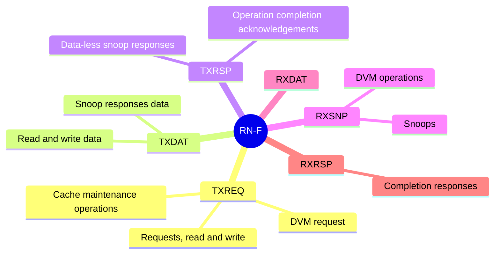

1. 在 CHI-E 中，一个节点可能有多个 CHI 接口。拥有多个接口可以让一个组件增加可用带宽。节点上某个接口被重复的次数由具体实现决定。每个接口都是独立的，拥有自己的 CHI 节点 ID，可以使用地址哈希来在接口之间分配请求和嗅探

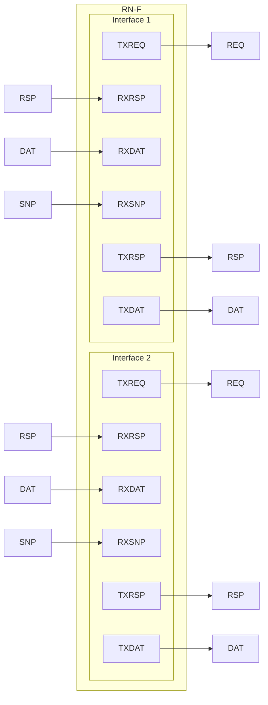

2. CHI-E 还允许在单个接口上复制通道。与其复制整个接口，不如单独复制各个通道。选择性地复制需要更大带宽的通道可以更高效地增加接口的可用带宽

   ```mermaid
   graph LR
       subgraph RN-F["RN-F"]
           SingleInterface["Single interface"]
           TXREQ0[TXREQ0]
           TXREQ1[TXREQ1]
           RXRSP0[RXRSP0]
           RXRSP1[RXRSP1]
           RXDAT0[RXDAT0]
           RXDAT1[RXDAT1]
           RXSNP0[RXSNP0]
           TXRSP0[TXRSP0]
           TXDAT0[TXDAT0]
           TXDAT1[TXDAT1]
       end
   
       %% 连线方向严格对应原图（向左为输入，向右为输出）
       TXREQ0 --> REQ0_out["REQ0"]
       TXREQ1 --> REQ1_out["REQ1"]
       RSP0_in["RSP0"] --> RXRSP0
       RSP1_in["RSP1"] --> RXRSP1
       DAT0_in["DAT0"] --> RXDAT0
       DAT1_in["DAT1"] --> RXDAT1
       SNP0["SNP0"] --> RXSNP0
       TXRSP0 --> RSP0_out["RSP0"]
       TXDAT0 --> DAT0_out["DAT0"]
       TXDAT1 --> DAT1_out["DAT1"]
   
       %% 将左侧标签设为透明，以靠近原图视觉
       style SingleInterface fill:none,stroke:none;
   ```

   

#### 3.3.3.2 SNP channel的约束

- Only the HN-F and MN issue messages on the SNP channel
- The RN-F accepts only snoops on the SNP channel
- The MN only issues DVM messages snoops on the SNP channel

### 3.3.4 关键标识符

| 标识符                     | 出现在哪些Flit           | 作用                 |
| -------------------------- | ------------------------ | -------------------- |
| **SrcID**                  | 所有                     | 谁发的？             |
| **TgtID**                  | REQ、RSP、DAT(除了snoop) | 发给谁？             |
| **TxnID**                  | 所有                     | 哪个事务？           |
| **DBID（Data Buffer ID）** | RSP、DAT                 | 数据缓冲区槽位号     |
| **Opcode**                 | 所有                     | 这条消息是什么类型？ |

> [!TIP]
>
> **TxnID**
>
> 识别源节点和目标节点之间的每一笔事务；来自RN的每个outstanding请求必须有一个唯一的TxnID。RN在任何时候最多可以有256或1024笔outstanding事务
>
> **DBID的妙用**：
>
> - 写请求时，Completer通过DBIDResp告诉Requester：“把数据发到我的第3号缓冲区”(requester只有在接收到DBID时才能发送写数据)
> - 读完成时，Data Flit带的DBID是给Requester用来发CompAck的：“收到数据了，告诉Home Node事务B完成了”
>
> **为什么snoop信道不需要TgtID字段？**
>
> snoop是由HN用实现自定义的方式路由到目标RN的。HN-F内部包含目录（directory）或snoop filter,记录了哪些RN-F持有特定地址的缓存副本。当snoop发出时，目标已经在HN的路由决策中确定，到达时已定向，所以不需要在flit中携带tgtid

**一个RN-F的TXREQ最终连到了谁的RXREQ？**

RN-F的TXREQ连接到**HN-F（或HN-I）的RXREQ**。然后HN-F根据SAM判断是否需要再发请求，此时HN-F通过自己的TXREQ连接到**SN-F的RXREQ**

### 3.3.5 握手机制：基于信用

CHI的握手机制不同于AXI的VALID/READY。它用的是**基于信用（Credit-based）的流控**

- 接收方告诉发送方：“我还能接收N个Flit”（这就是信用）
- 发送方只有在还有信用时才能发Flit
- 接收方用`LCRDV`信号来授予信用

| 对比维度     | AXI (VALID/READY)                    | CHI (Credit-based)                                     |
| ------------ | ------------------------------------ | ------------------------------------------------------ |
| **流控方式** | 每次传输都需要发送方和接收方同时握手 | 接收方预先告知发送方可用的缓冲槽数量                   |
| **效率**     | 每次握手都有往返延迟                 | 发送方可连续发送多个Flit，直到信用用完                 |
| **适用场景** | 点到点连接，延迟可控                 | 片上网络(NoC)，多跳路由                                |
| **反压机制** | READY=0时直接反压                    | 信用为0时发送方必须等待，接收方通过LCRDV信号授予新信用 |

> [!IMPORTANT]
>
> CHI采用信用机制的核心原因是拓扑灵活性——在mesh或ring拓扑中，多条传输的延迟不可预测，信用机制可以更高效地利用链路带宽

在 CHI 中传输 Flit 的握手机制和 ACE 中的不同。每个通道都关联一个 `FLITV` 信号，发送方会将该信号置高以表示 Flit 有效。然后，传输会在`下一个上升沿的 CLK` 时发生。发送方只有在之前从接收方收到信用时才可以发送 Flit。接收方通过` LCRDV` 置位并在 CLK 上升沿确认来表示信用。

## 3.4 系统地址映射（SAM）

系统中的每个组件都会分配一个唯一的Node ID,**System Address Map (SAM)** 是每个RN和HN内部的“导航地图”，它把**物理地址**翻译成**目标Node ID**

### 3.4.1 两级翻译过程

**SAM映射存在于RN和HN**

```
CPU(RN)                    HN-F                       SN-F
   │                         │                          │
   │  地址0x8000_0000        │                          │
   ├────────────────────────►│                          │
   │  RN SAM查到→Node 5      │                          │
   │                         │ HN SAM查到→Node 2        │
   │                         ├─────────────────────────►│
   │                         │                          │
```

**第一级**：RN的SAM将物理地址翻译为目标HN的Node ID（TgtID）
**第二级**：HN的SAM将物理地址翻译为目标SN的Node ID

> [!NOTE]
>
> SAM 的具体格式和结构完全由实现决定。CHI 规范没有提供关于如何将地址映射到节点 ID 的指导

### 3.4.2 为什么需要两级翻译？

**RN只需要知道**"这件事找哪个HN"，RN的SAM可以比较简单。
**HN负责精细路由**"最终去哪个SN"，HN的SAM负责全地址空间的解码。

这种设计使得RN端的SAM逻辑简化，而系统级的路由策略集中在HN中管理，便于扩展和重构。

### 3.4.3 RN SAM必须满足的要求

> [!IMPORTANT]
>
> 1. **两个不同RN的SAM必须一致**：同一个物理地址无论在哪个RN发出，都必须映射到同一个HN的node id。
> 2. RN SAM必须实现系统地址空间的全映射。
> 3. CHI协议建议所有没有对应物理组件的地址都应该分配给一个node,该node可以对这些无用地址的访问提供恰当的error响应。

### 3.4.3 练习

1. 画一个包含1个CPU(RN-F)、1个DMA(RN-I)、1个HN-F、1个SN-F、1个MN的系统，标出节点的TX/RX信道

   ```
              TXREQ──────►  RXREQ
     RN-F    ◄──────RXRSP  TXRSP     HN-F
     (CPU)   ◄──────RXSNP  TXSNP     
              TXDAT──────►  RXDAT     
              ◄──────RXDAT  TXDAT     
   
              TXREQ──────►  RXREQ
     RN-I    ◄──────RXRSP  TXRSP     HN-F  / HN-I
     (DMA)   TXDAT──────►  RXDAT
   
              TXREQ──────►  RXREQ
     HN-F    ◄──────RXRSP  TXRSP     SN-F
             TXDAT──────►  RXDAT     (DDR)
              ◄──────RXDAT  TXDAT
   
              TXREQ──────►  RXREQ
     RN-F    ◄──────RXRSP  TXRSP     MN
     (DVM)   
   ```

2. CPU读一个地址后修改部分字节，缓存行经历的状态变化

```
初始状态：I (Invalid)
    │ CPU发起Read请求
    ▼
UC (Unique Clean)  ← 从内存读到数据，独占且干净
    │ CPU只写部分字节（Partial Write）
    ▼
UCE (Unique Clean Empty)  ← 先把所有权抢过来，标记Empty
    │ 写入部分字节
    ▼
UDP (Unique Dirty Partial) ← 部分脏数据，状态为Partial
```

3. 写出ReadNoSnp请求的request flit关键字段

   | 字段       | 典型值      | 说明                                 |
   | ---------- | ----------- | ------------------------------------ |
   | **SrcID**  | 0x01        | 发起请求的RN-F的Node ID              |
   | **TgtID**  | 0x05        | 目标HN-F的Node ID（由RN的SAM查得）   |
   | **TxnID**  | 0x0A        | 事务ID，用于匹配Request和Response    |
   | **Opcode** | ReadNoSnp   | 指示这是不需要Snoop的读请求          |
   | **Addr**   | 0x8000_0000 | 目标物理地址                         |
   | **Size**   | 0x06 (64B)  | 读取大小，典型为64字节（一个缓存行） |

# 4. 事务流程

事务类型分为：读事务、无数据事务、写事务、原子事务等

## 4.1 写请求和标识符

1. 完成器将请求的交易ID和源ID分配给一个可用的数据缓冲槽。在本例中，请求被分配了数据缓冲ID（DBID）0。如下图所示：`A requester sending a write request`

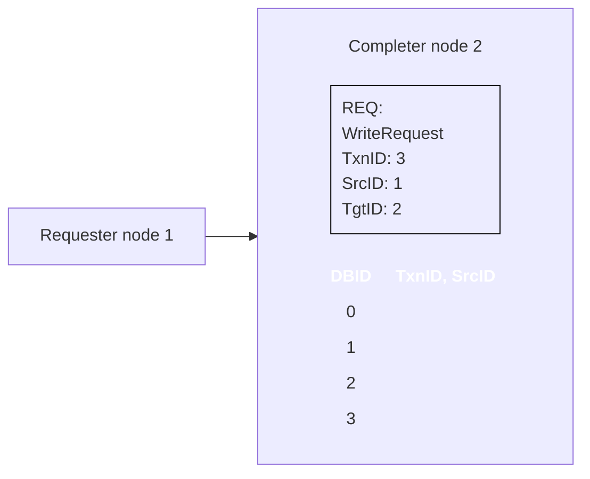

2. 完成者向请求者发送一个 DBIDResp 消息，包含 TxnID 3 和 DBID 值 0，如下图所示:`A completer sending a DBIDResp message`

   ```mermaid
   flowchart LR
       subgraph ReqNode ["Requester node 1"]
           direction TB
           ReqContent["RSP: DBIDResp<br>TxnID: 3<br>SrcID: 2<br>TgtID: 1<br>DBID: 0"]
       end
       %% 使用 全角空格 或 `&nbsp;` 来硬对齐
       CompNode["<div style='text-align:center; font-family:monospace;'>Completer node 2<br><br>DBID | TxnID, SrcID<br>---- | ----------<br>0 | &nbsp;&nbsp;&nbsp;| <br>1 | &nbsp;&nbsp;&nbsp;| <br>2 | &nbsp;&nbsp;&nbsp;| <br>3 | &nbsp;&nbsp;&nbsp;| <br></div>"]
       ReqContent --> CompNode
       
   ```

3. 请求者使用作为事务ID接收到的DBID将写入数据发送给完成者

4. 当事务完成时，对应 DBID 0 的缓冲区槽会被释放。

## 4.2 WriteNoSnp Transaction flow

1. 请求节点 0 在 TXREQ 通道上向主节点 3 发送 WriteNoSnp 消息，如图所示:

   ```mermaid
   flowchart TD
       R0["Requester node 0"]
       R1["Requester node 1"]
       subgraph CHI["CHI Interconnect"]
           H3["Home node 3"]
           H4["Home node 4"]
           B(["WriteNoSnp"])
       end
       C5["Completer node 5"]   
       R0 --- CHI
       R1 --- CHI
       B -.-> H3
       R0 -.-TXREQ -.- B
    style C5 fill:#FFD700
    style B fill:#87CEEB,stroke:transparent
      
   ```

2. HN3 使用 CompDBIDResp 消息响应请求节点 0。这个响应表示它可以接受写入数据，并且其他请求者可以看到 WriteNoSnp。这条消息通过HN3的 TXRSP 通道发送。这个步骤在下图中展示：

   ```mermaid
   flowchart TD
       R0["Requester node 0"]
       R1["Requester node 1"]
       R2["Requester node 2"]
       
       DBI([CompDBIResp])
       
       subgraph CHI["CHI Interconnect"]
           H3["Home node 3"]
           H4["Home node 4"]
       end
       
       C5["Completer node 5"]
       
       R1 --- CHI
       R2 --- CHI
       H3 -.-TXRESP-.- DBI
       DBI -.-> R0
       
       style C5 fill:#FFD700
       style DBI fill:#87CEEB,stroke:transparent
   ```

3. 以下两个步骤的发生不分先后顺序：

   - HN3发送WriteNoSnp消息到完成者node5并接收一个CompDBIResp响应,如下图：

     ```mermaid
     flowchart TD
         R0["Requester node 0"]
         R1["Requester node 1"]
         R2["Requester node 2"]
         
         subgraph CHI["CHI Interconnect"]
             H3["Home node 3"]
             H4["Home node 4"]
         end
         
         subgraph C5["Completer node 5"]
             Comp([CompDBIDResp])
             Write([WriteNoSnp])
         end
     
         R0 --- CHI
         R1 --- CHI
         R2 --- CHI
         Comp -.-> H3
         H3 -.-> Write
     
         style Comp fill:#87CEEB,stroke:transparent
         style Write fill:#87CEEB,stroke:transparent
     ```

   - RN0通过TXDAT通道将WriteNoSnp的写入数据发送到HN3，如图所示：

     ```mermaid
     flowchart TD
         R0["Requester node 0"]
         R1["Requester node 1"]
         R2["Requester node 2"]
         
         subgraph CHI["CHI Interconnect"]
             WrData(["WrData"])
             H3["Home node 3"]
             H4["Home node 4"]
         end
     
         C5["Completer node 5"]
     
         R0 -.-TXDAT-.-> WrData
         WrData -.-> H3
         
         R1 --- CHI
         R2 --- CHI
     
         style WrData fill:#87CEEB,stroke:transparent
         style C5 fill:#FFD700
     ```

4. 在从完成节点收到 CompDBIDResp，以及从请求节点收到写数据后，HN3 会通过 TXDAT 通道将写数据发送给完成节点 5，如图所示：

   ```mermaid
   flowchart TD
       R0["Requester node 0"]
       R1["Requester node 1"]
       R2["Requester node 2"]
       
       subgraph CHI["CHI Interconnect"]
           H3["Home node 3"]
           H4["Home node 4"]
       end
   
       subgraph C5["Completer node 5"]
           WrData(["WrData"])
       end
   
       R0 --- CHI
       R1 --- CHI
       R2 --- CHI
   
       H3 -.-TXDAT-.-> WrData
   
       style WrData fill:#87CEEB,stroke:transparent
       style C5 fill:#fff,stroke:#333
   ```

   

## 4.2 ReadNoSnp(最简单的读事务)

### 4.2.1 ReadNoSnp with ExpCompAck=0

1. 适用于**非一致性区域**的读取，或者从HN出发向SN获取数据时使用

2. 流程分步解析：

   ```
   RN (Requester)                HN (Home Node)                SN (Subordinate)
        │                              │                              │
        │ ① ReadNoSnp Request         │                              │
        │─────────────────────────────►│                              │
        │  (SrcID=RN, TgtID=HN,       │                              │
        │   TxnID=0x01, Addr=0x8000)  │                              │
        │                              │                              │
        │                              │ ② ReadNoSnp Request         │
        │                              │─────────────────────────────►│
        │                              │  (SrcID=HN, TgtID=SN,       │
        │                              │   TxnID=0x01, Opcode=        │
        │                              │   ReadNoSnp)                 │
        │                              │                              │
        │                              │ ③ CompData Response         │
        │                              │◄─────────────────────────────│
        │                              │  (带着数据回来了！)          │
        │                              │                              │
        │ ④ CompData Response         │                              │
        │◄─────────────────────────────│                              │
        │  (数据送到RN手里)           │                              │
        │                              │                              │
        │ ⑤ CompAck                   │                              │
        │─────────────────────────────►│                              │
        │  (“货收到了，订单完结”)     │                              │
   ```

- ReadNoSnp的数据是在CompData响应中携带的，不需要单独的数据信道
- 数据大小最大为缓存行长度，基于请求中的Size属性值
- RN获得的数据不会以系统一致的方式缓存在请求方——也就是说，你可以本地暂存，但系统不保证一致性

### 4.2.1 ReadNoSnp with ExpCompAck=1

1. 请求者向完成者发送地址为0x8000的读取请求，并将ExpCompAck字段设为1，如图所示：

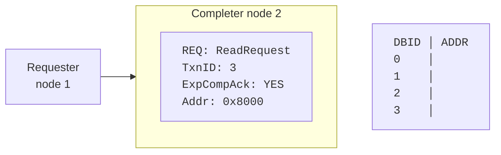

2. 完成者会为读取地址分配一个任意的 DBID 位置，从而阻止互连为后续对其的一致性请求发出嗅探。这个位置在图中显示出来了:

   ```mermaid
   flowchart LR
       %% 定义节点
       N1["Requester<br>node 1"]
       
       subgraph N2["Completer node 2"]
           direction TB
           ReqBox["REQ: ReadRequest<br>TxnID: 3<br>ExpCompAck: YES<br>Addr: 0x8000"]
       end
       
       %% 使用 &nbsp; 来强制对齐表格列
       Table["DBID &nbsp;&nbsp;│ ADDR<br>0 &nbsp;&nbsp;&nbsp;&nbsp;│<br>1 &nbsp;&nbsp;&nbsp;&nbsp;│<br>2 &nbsp;&nbsp;&nbsp;&nbsp;│ 0 x 8000<br>3 &nbsp;&nbsp;&nbsp;&nbsp;│"]
   
       %% 连接线：修正为框到表格的箭头，还原图片中的指向关系
       N1 --> N2
       ReqBox --> Table
   
       %% 设置排版对齐和字体
       style N2 text-align:left
       style Table text-align:left
       
       %% 让表格节点和边框节点强制使用等宽字体，防止表格在渲染时串列错位
       classDef monoFont font-family:'Courier New', Courier, monospace;
       classDef leftAlign text-align:left;
       class Table,ReqBox monoFont;
       class ReqBox leftAlign;
   ```

3. 完成者会向请求者发送一个 CompData 响应，表示事务已完成，并同时发送读取的数据。响应中的 DBID 字段会填入用于存储读取地址的位置的 DBID。这个步骤如下面的图所示。

   ```mermaid
   flowchart LR
       %% 定义节点
       subgraph N1["Requester node 1"]
           direction TB
           DATBox["DAT: CompData<br>TxnID: 3<br>DBID: 2"]
       end
       
       N2["Completer node 2"]
       
       %% 使用 &nbsp; 来强制对齐表格列，配合表头列名变化
       Table["DBID &nbsp;&nbsp;│ TxnID, SrcID<br>0 &nbsp;&nbsp;&nbsp;&nbsp;&nbsp;│<br>1 &nbsp;&nbsp;&nbsp;&nbsp;&nbsp;│<br>2 &nbsp;&nbsp;&nbsp;&nbsp;&nbsp;│ 0 x 8000<br>3 &nbsp;&nbsp;&nbsp;&nbsp;&nbsp;│"]
   
       %% 连接线：N2 指向 N1 内部的 DAT 框（对应右侧返回的响应箭头）
       N2 --> DATBox
       N2 ~~~ Table
   
       %% 设置排版对齐和字体
       style N1 text-align:left
       style N2 text-align:left
       style Table text-align:left
       
       %% 让表格节点和边框节点强制使用等宽字体，防止表格在渲染时串列错位
       classDef monoFont font-family:'Courier New', Courier, monospace;
       classDef leftAlign text-align:left;
       class Table,DATBox monoFont;
       class DATBox leftAlign;
   ```

4. 请求方发送一个 CompAck 消息。CompAck 使用它从完成方收到的 DBID 值作为事务 ID，如图所示:

   ```mermaid
   flowchart LR
       %% 定义节点
       N1["Requester<br>node 1"]
       
       subgraph N2["Completer node 2"]
           direction TB
           RSPBox["RSP: CompAck<br>TxnID: 2"]
       end
       
       %% 使用 &nbsp; 来强制对齐表格列
       Table["DBID &nbsp;&nbsp;│ TxnID,SrcID<br>0 &nbsp;&nbsp;&nbsp;&nbsp;&nbsp;│<br>1 &nbsp;&nbsp;&nbsp;&nbsp;&nbsp;│<br>2 &nbsp;&nbsp;&nbsp;&nbsp;&nbsp;│ 0 x 8000<br>3 &nbsp;&nbsp;&nbsp;&nbsp;&nbsp;│"]
   
       %% 连接线：由于本图为响应的内部状态，图中无可见的连线箭头
       N1 ~~~ N2
       N2 ~~~ Table
   
       %% 设置排版对齐和字体
       style N1 text-align:left
       style N2 text-align:left
       style Table text-align:left
       
       %% 让表格节点和边框节点强制使用等宽字体，防止表格在渲染时串列错位
       classDef monoFont font-family:'Courier New', Courier, monospace;
       classDef leftAlign text-align:left;
       class Table,RSPBox monoFont;
       class RSPBox leftAlign;
   ```

5. 完成者清除地址 0x8000 的 DBID 位置，让互连可以对这个位置发起后续的嗅探。

## 4.4 引入Snoop(当数据可能被共享时)

1. 如果要读的是一个**一致性地址**，那HN就需要先问问其他可能持有缓存副本的RN，这时候就需要snoop了

2. 比如ReadNotSharedDirty等“分配型读”（Allocting Read）的典型流程。这类事务读完后会在本地缓存中分配一个新行，为后续读写复用做准备

   场景：RN-F0想读一个地址，RN-F1可能持有脏数据

   ```
   RN-F0 (请求者)          HN-F (Home)            RN-F1 (被Snoop者)        SN-F (内存)
       │                       │                       │                      │
       │① ReadNotSharedDirty  │                       │                      │
       │──────────────────────►│                       │                      │
       │                       │② SnpNotSharedDirtyFwd│                      │
       │                       │──────────────────────►│                      │
       │                       │                       │③ SnpRespDataFwd     │
       │                       │◄──────────────────────│   (脏数据直接转给    │
       │                       │                       │    RN-F0)           │
       │                       │                       │                      │
       │④ CompData (来自RN-F1的脏数据)                 │                      │
       │◄──────────────────────│                       │                      │
       │                       │                       │                      │
       │⑤ CompAck             │                       │                      │
       │──────────────────────►│                       │                      │
   ```

- HN通过目录或snoop filter知道RN-F1持有该缓存行的副本（且可能是脏的）
- HN发送SnpNotSharedDirtyFwd(注意结尾的Fwd),指示RN-F1直接把数据转发（Forward）给RN-F0，不需要经过HN中转！
- RN-F1返回SnpRespDataFwd，数据直达RN-F0
- 这种“数据直传”就是第8章要讲的DCT（direct cache transfer）的雏形

> [!NOTE]
>
> Fwd表示“把数据直接转发给原始请求者”，省去HN中转这一步，降低延迟

### 4.4.1 CompAck with Snoops

这个例子展示了当你需要完成确认时，多个请求节点访问同一个可缓存内存位置时发送的消息。在这个例子中，CHI互连会向所有缓存请求者广播嗅探。或者，它也可以使用嗅探过滤器，只针对本地存在该缓存行的请求者。下面的列表描述了事件的顺序：

1. 请求节点 0 向主节点 3 发出地址 A 的 MakeUnique 消息。当请求节点 0 向主节点 3 发出完成确认时，该事务完成。这个步骤如下图所示：

   ```mermaid
   flowchart TD
       %% 定义顶层节点
       R0["Requester node 0"]
       R1["Requester node 1"]
       R2["Requester node 2"]
   
       %% 定义中间层互联及内部节点
       subgraph CHI["CHI Interconnect"]
           direction LR
           
           %% Home node 3 及其内部的 MakeUnique A 标签
           subgraph HN3["Home node 3"]
               direction TB
           end
           
           MUA1(["MakeUnique A"])
           %% Home node 4
           HN4["Home node 4"]
       end
   
       %% 定义底层节点
       CN5["Completer node 5"]
   
       %% 连接线与布局（依照图片箭头走向）
       R0 -.-> MUA1
       R1 --- CHI
       R2 --- CHI
       MUA1 -.-> HN3
       
       %% 底部无箭头连接，使用 ~~~ 控制在 CHI 节点的正下方
       CHI ~~~ CN5
       R1 ~~~ R2
   
       %% 强制套用上一版提供的样式规范
       style CHI text-align:left
       style HN3 text-align:left
       style HN4 text-align:left
       style R0 text-align:center
       style R1 text-align:center
       style R2 text-align:center
       style CN5 text-align:center
       
       %% 应用文字排版样式（等宽字体、左对齐）
       classDef monoFont font-family:'Courier New', Courier, monospace;
       classDef leftAlign text-align:left;
       classDef blueLabel fill:#0099cc,color:#ffffff,font-weight:bold,stroke:none;
   
       class R0,R1,R2,HN4,CN5 monoFont;
       class HN3,MUA1 leftAlign;
       class MUA1 blueLabel;
   ```

2. 如图所示，3号主节点对地址A向请求节点1和2发出SnpMakeInvalid嗅探

   ```mermaid
   flowchart TD
       %% 请求节点（去掉标签，保持干净）
       R0["Requester node 0"]
       R1["Requester node 1"]
       R2["Requester node 2"]
       
       %% CHI 互联子图，内部只保留 Home node 3 和 4（无连线）
       subgraph CHI["CHI Interconnect"]
           HN3["Home node 3"]
           HN4["Home node 4"]
       end
   
       SNPA1(["SnpMakeInvalid A"])
       SNPA2(["SnpMakeInvalid A"])
      
       %% 完成节点（保留，但无箭头）
       CN5["Completer node 5"]
   
       %% 2. 从 Home node 3 引出两条箭头指向两个 SnpMakeInvalid A 节点
       HN3 -.- SNPA1 -.-> R1
       HN3 -.- SNPA2 -.-> R2
       
       %%相对位置
       R0 ~~~ CN5
       
       %% 样式规范（沿用您的设定）
       style CHI text-align:left
       style HN3 text-align:left
       style HN4 text-align:left
       style R0 text-align:center
       style R1 text-align:center
       style R2 text-align:center
       style CN5 text-align:center
       style SNPA1 text-align:center
       style SNPA2 text-align:center
   
       classDef monoFont font-family:'Courier New', Courier, monospace;
       classDef leftAlign text-align:left;
       classDef blueLabel fill:#0099cc,color:#ffffff,font-weight:bold,stroke:none;
   
       class R0,R1,R2,HN4,CN5,SNPA1,SNPA2 monoFont;
       class HN3 leftAlign;
       class SNPA1,SNPA2 blueLabel
   ```

3. 请求节点 1 和 2 用 SnpResp响应。这些响应表示地址 A 已经被作废。主节点 3 可以以任意顺序接收 SnpResp。这一步在图中显示如下：

   ```mermaid
   flowchart TD
       %% 请求节点
       R0["Requester node 0"]
       R1["Requester node 1"]
       R2["Requester node 2"]
       
       %% CHI 互联子图
       subgraph CHI["CHI Interconnect"]
           HN3["Home node 3"]
           HN4["Home node 4"]
       end
   
       %% 定义蓝色标签节点（修正文本及形状为直角框）
       SNPA1(["SnpMakeInvalid A"])
       SNPA2(["SnpResp"])
      
       %% 完成节点
       CN5["Completer node 5"]
   
       %% 连接关系（修正箭头指向 Home node 3）
       HN3 -.- SNPA1 -.-> R2
       R1 -.- SNPA2 -.-> HN3
       R0 --- CHI
       
       %% 布局控制（让 Completer node 位于正下方）
       HN3 ~~~ CN5
   
       %% 样式规范（沿用您的设定）
       style CHI text-align:left
       style HN3 text-align:left
       style HN4 text-align:left
       style R0 text-align:center
       style R1 text-align:center
       style R2 text-align:center
       style CN5 text-align:center
       style SNPA1 text-align:center
       style SNPA2 text-align:center
   
       classDef monoFont font-family:'Courier New', Courier, monospace;
       classDef leftAlign text-align:left;
       classDef blueLabel fill:#0099cc,color:#ffffff,font-weight:bold,stroke:none;
   
       class R0,R1,R2,HN4,CN5,SNPA1,SNPA2 monoFont;
       class HN3 leftAlign;
       class SNPA1,SNPA2 blueLabel
   ```

4. 请求节点 2 向主节点 3 发送了对地址 A 的 ReadShared 请求。请注意，主节点 3 仍然没有回应来自请求节点 0 的 MakeUnique 消息。由 ReadShared 请求生成的任何嗅探现在都会被阻塞，直到请求节点 0 发送 MakeUnique 的完成确认消息。这一步在图中显示:

   ```mermaid
   flowchart TD
       %% 请求节点
       R0["Requester node 0"]
       R1["Requester node 1"]
       R2["Requester node 2"]
       
       %% CHI 互联子图
       subgraph CHI["CHI Interconnect"]
           HN3["Home node 3"]
           HN4["Home node 4"]
       end
   
       %% 定义蓝色标签节点
       ReadA(["ReadShared A"])
      
       %% 完成节点
       CN5["Completer node 5"]
   
       %% 连接关系（修正为 R2 指向 HN3）
       R2 -.- ReadA -.-> HN3
       R0 --- CHI
       R1 --- CHI
       
       %% 布局控制（让 Completer node 位于正下方）
       HN3 ~~~ CN5
   
       %% 样式规范（沿用您上轮的设定，适配新图的节点）
       style CHI text-align:left
       style HN3 text-align:left
       style HN4 text-align:left
       style R0 text-align:center
       style R1 text-align:center
       style R2 text-align:center
       style CN5 text-align:center
       style ReadA text-align:center
   
       classDef monoFont font-family:'Courier New', Courier, monospace;
       classDef leftAlign text-align:left;
       classDef blueLabel fill:#0099cc,color:#ffffff,font-weight:bold,stroke:none;
   
       class R0,R1,R2,HN4,CN5,ReadA monoFont;
       class HN3 leftAlign;
       class ReadA blueLabel
   ```

5. 因为在步骤3中收到了Snoop响应，Home节点3向Request节点0发送了一个Comp_UC消息

6. 请求节点0发送CompAck消息并解除对地址A的Snoops阻塞

7. HOME节点 3 为地址 A 向请求节点 0 和 1 生成 SnpShared Snoops

8. 请求节点1用SnpResp作出响应，表示它没有数据。

9. 请求节点 0 使用 SnpRespData 响应，发送地址 A 的最新数据。主节点 3 可以以任意顺序接收这两个响应

10. 在收到两个 Snoop 响应后，HOME节点3会把 Snoop 数据返回给请求节点2。

11. 请求节点2向主节点3发送完成确认。主节点3可以生成后续的嗅探来处理地址A。

## 4.5 写事务（从CopyBack到WriteUnique）

CHI的写事务分为两大类: CopyBack写和非CopyBack写（也叫立即写）

| 分类                   | 含义                       | 典型事务                                    | 使用场景          |
| ---------------------- | -------------------------- | ------------------------------------------- | ----------------- |
| **CopyBack Write**     | 把脏数据从 RN 写回下级存储 | WriteBackFull, WriteBackPtl, WriteEvictFull | 缓存淘汰时        |
| **Non-CopyBack Write** | 不要求先获得缓存行的写权限 | WriteNoSnp, WriteUniquePtl 等               | 直接写入内存/设备 |

### 4.5.1 CopyBack Write:缓存淘汰时如何“搬家”

当CPU修改了处于**Unique**状态的缓存行，这个“脏”数据最终需要通过**WriteBackFull**事务写回内存

**WriteBackFull流程：**

```
RN (持有UD)               HN-F                       SN-F
    │                       │                          │
    │① WriteBackFull       │                          │
    │  (带着脏数据)         │                          │
    │──────────────────────►│                          │
    │                       │② WriteNoSnp (带数据)    │
    │                       │─────────────────────────►│
    │                       │                          │
    │                       │③ CompAck                │
    │                       │◄─────────────────────────│
    │                       │                          │
    │④ CompAck             │                          │
    │◄──────────────────────│                          │
```

如果只修改了缓存行的部分字节，可以用**WriteBackPtl**只传输被修改过的部分，节省带宽

**WriteEvictFull**则用于将处于**UC（Unique Clean）**状态的缓存行写回并立即将其置为无效。因为UC是干净的，所以不需要真的写数据，只是告诉HN“我不要这行了”

### 4.5.2 WriteUnique系列：我不仅要写，还要独占！

WriteUnique用于向可侦听地址区域写入数据，系统保证写入操作的一致性。写入前，必须使系统中所有其他缓存副本无效。

| 事务类型            | 写入大小          | 特点                   |
| ------------------- | ----------------- | ---------------------- |
| **WriteUniqueFull** | 完整缓存行（64B） | 写整行，获取独占权     |
| **WriteUniquePtl**  | ≤一行，任意BE组合 | 部分写入，获取独占权   |
| **WriteUniqueZero** | 完整缓存行        | 写全零值，不传数据字节 |

WriteUniquePtl关键流程：

1. **RN-F0 发送 WriteUniquePtl 请求**给 HN-F
2. **HN-F 向其他持有该地址副本的 RN 发送 SnpCleanInvalid**，使其无效并返回可能的脏数据
3. **HN-F 向 RN-F0 发送 DBIDResp**，告知数据发送到哪个缓冲区
4. **RN-F0 发送 NonCopyBackWriteData** 给 HN-F
5. **数据合并**：如果从其他缓存收到了脏数据片段，HN-F 需要将新旧数据**合并**，生成完整的行
6. **HN-F 将合并后的数据写入 SN-F**，并发 **Comp** 完成响应给 RN-F0

WriteUniquePtl的数据合并发生在**HN-F**。HN-F需要把RN-F0提供的新写数据和其他RN返回的旧数据/脏数据合并，再写入内存

## 4.6 理解CompAck和Order机制

1. CompAck是Requester收到ComData之后返回给Completer的“确认收据”

- **维持同一地址请求的顺序**：如果两个对同一地址的请求A和B先后到达HN，HN必须确保A先完成，B后完成，CompAck就是HN知道“A确实已经到达Requester”的信号
- **防止死锁**:因为CompAck的返回不依赖其他事务的完成，它独立占用信用
- 如果不发CompAck，HN无法确定上一个同地址请求是否已到达Requester,可能导致后续请求拿到过期数据，破坏一致性。

> [!NOTE]
>
> #### ExpCompAck 和 Order 字段
>
>  **ExpCompAck**（期望 CompAck）这个属性。Requester 在发请求时可以选择声明 ExpCompAck，告诉 HN：“这次我给你发 CompAck 确认”
>
> - 如果声明了 **ExpCompAck**，则**允许使用 DMT**（Direct Memory Transfer，直接内存传输）
> - 如果同时声明了 **ExpCompAck 和 Order**，也允许 DMT
>
> **Order 字段**用于控制事务之间的顺序。当 Order 被断言时，该事务必须按照它到达 HN 的顺序被处理。

2. CHI 使用完成确认响应来保持以下事务的顺序：

   - Transactions issued by a Fully Coherent Request Node (RN-F)
   - Snoop transactions caused by these RN-F transactions

   compack确保在对同一缓存行地址的 RN-F 发起的相关事务完成之前，由其他RN-F 发起的 snoop 事务不会被 RN-F 接收。HN-F 可以通过阻塞（stall）事务来维持事务顺序。例如，一个 RN-F 可能已经有一个正在处理特定缓存行的未完成事务。如果系统中的另一个请求方发起了对同一缓存行的 snoop 事务，HN-F 就可以阻塞这个后续事务。当原 RN-F 完成相关事务后，原RN-F 会通过其 TXRSP 通道向 HN-F 发送完成确认（CompAck）消息。然后，HN-F 解锁那些等待完成确认的 snoop 事务。这一机制的功能类似于 ACE 中的 RACK/WACK。并非 CHI 中的每个事务都需要完成确认。请求 Flits 中包含一个 ExpCompAck 字段，用来标示是否需要完成确认。如果需要完成确认，RN-F 会在请求中将 ExpCompAck 置为 1，并在请求完成时发出 CompAck 响应。

   **流程如下：**

   1. The Request Node (RN-F) issues a Request with ExpCompAck = 1. 
   2. The Home Node completes the Request. 
   3. The Home Node sends Comp or CompData to the RN-F. 
   4. The RN-F sends a CompAck to the Home Node. 
   5. The Home Node can now send a waiting Snoop to the RN-F.

3. 事件的顺序如下：

   1. 请求者向下属发起带有 ReqOrder 设置的读取请求1 

   2. 请求者向下属发出读取请求 2，同样带有 ReqOrder 设置，但由于请求 1 还未完成，请求者被阻止发送该请求。

   3. 下属回复读取请求 1 的 ReadReceipt 消息，表示该请求已被接受。

   4. 以下顺序可任意：

      a. 请求者向下属发送读取请求 2。

      b. 下属将读取请求 1 的数据返回给请求者。

## 4.7 请求重试Retry机制

当一个HN或SN忙于处理其他请求，暂时无法接收新请求时，它可以发RetryAck给Requester,说“我太忙了，你过会儿再来”

```
RN                          HN
 │                           │
 │① Request                  │
 │──────────────────────────►│
 │                           │
 │② RetryAck                 │
 │◄──────────────────────────│   (HN繁忙)
 │                           │
 │... 等待 ...               │
 │                           │
 │③ PcrdGrant                │
 │◄──────────────────────────│   (HN有空了)
 │                           │
 │④ Request (重新发送)       │
 │──────────────────────────►│
```

**PcrdGrant**(Protocol Credit Grant)是HN通知RN“现在可以重试”的信号。RN只有在收到PcrdGrant后，才能重新发送之前被Retry的请求。

**示例**

1. 每个请求最初都是在没有协议信用的情况下发出的。请求Flit有一个叫做AllowRetry的控制字段。第一次发送请求时将此字段设置为YES表示该请求没有使用协议信用。当AllowRetry为YES时，请求中的PCrdType字段必须为0。下图显示了请求的设置：

   ```mermaid
   flowchart LR
       %% 定义节点
       N1["Completer <br>node 2"]
       
       subgraph N2["Requester node 1"]
           direction TB
           ReqBox["REQ: Read Request1<br>TxnID: 1<br>aLLOWrETRY: YES<br>pcRDtYPE: 0"]
       end
       
       Table[" &nbsp;&nbsp│Requester buffers<br>0 │FULL<br>1 │FULL<br>2 │FULL<br>3 │FULL"]
   
       %% 连接线
       N2 --> N1
       N2 ~~~ N1
       N1 ~~~ Table
   
       %% 设置排版对齐和字体
       style N2 text-align:left
       style Table text-align:left
       
       %% 可选：让表格节点和边框节点强制使用等宽字体，防止表格串列
       classDef monoFont font-family:'Courier New', Courier, monospace;
       classDef leftAlign text-align:left;
       class Table,ReqBox monoFont;
       class ReqBox leftAlign;
   ```

2. 在这个例子中，目标无法接受请求，因为请求者缓冲区已满，所以它会以 RetryAck 消息作出响应

3. RetryAck 响应帧会设置一个 PCrdType 字段，其值表示重试请求所需的信用类型。在这个例子中，PCrdType 的值是 2，如图所示：

   ```mermaid
   flowchart LR
       %% 定义节点（内容完全与图片一致）
       Requester["Requester<br>node 1"]
       
       Completer["Completer<br>node 2<br><br>┌─────────────┐<br>│RSP: RetryAck│<br>│TxnID: 1&nbsp;&nbsp;&nbsp;&nbsp;&nbsp;│<br>│PCrdType: 2&nbsp;  │<br>└─────────────┘"]
   
       BufferTable["&nbsp;&nbsp;│Requester buffers<br>0 │ FULL<br>1 │ FULL<br>2 │ FULL<br>3 │ FULL"]
   
       %% 布局关系连接线（使用不可见连线确保水平排列）
      Completer--> Requester
   
       %% 样式设置（完全复用您提供的样式风格）
       style Requester text-align:left
       style Completer text-align:left
       style BufferTable text-align:left
   
       classDef monoFont font-family:'Courier New', Courier, monospace;
       classDef leftAlign text-align:left;
       class Requester,Completer,BufferTable monoFont;
       class BufferTable leftAlign;
   ```

4. 当目标可以接受请求时，它会在 RSP 通道上发送 PCrdGrant 消息。PCrdGrant 响应 Flit 使用 PCrdType 字段来指示可用的协议信用类型。请求方只有在 PCrdGrant 消息和 RetryAck 响应中的协议信用类型匹配时才会重试请求。在这个例子中，这两个字段都必须设置为 2。如果协议信用类型匹配，目标节点就保证现在可以接受请求了。

5. 请求者重新发出请求，并将 AllowRetry 字段设置为 0。将 AllowRetry 字段设置为 0 表示向目标节点表明该请求正在使用已授予的协议额度。

# 5. DVM Operations

1. 在虚拟化系统中，多个操作系统或虚拟机共享同一个物理CPU，它们各自拥有独立的页表。当某个虚拟机修改了页表项，就需要通知所有可能持有该虚拟地址TLB项的处理器核心：“这个映射失效了，快情掉！”，这个过程就是DVM（Distributed Virtual Memory）操作
2. CHI协议用两阶段消息流来高效完成这个分布式广播。

## 5.1 DVM操作是什么

1. **DVM** 的字面意思是“分布式虚拟内存”。但更准确地说，DVM操作是CHI协议中**管理虚拟化相关缓存（如TLB、指令缓存）的一致性操作**
2. **相关事务**

- **TLB无效化（TLBI）**：让TLB中的某个虚拟地址映射失效
- **指令缓存无效化（IC IALLU）**:让所有核的指令缓存全部无效化
- **BPIALL**：分支预测器无效化
- **DVM同步**

## 5.2 两阶段发送

CHI的DVM操作与ACE最大的不同是：所有DVM操作都分两阶段发送

```
第一阶段：DVM Request → MN → 广播给所有RN-D/RN-F
第二阶段：等待所有RN响应 → MN返回完成响应给原始请求者
```

- DVM 操作的第一部分会作为请求发送给 MN，Opcode 字段设置为 DVMOp。请求 Flit 使用 **Address** 字段来编码操作的属性。
- DVM 的第二部分会作为数据片发送，只有在请求节点收到来自 MN 的 DBID 响应后才会发送。这第二部分携带 DVM 操作要访问的地址。

当 MN 收到 DVM 操作的两个部分时，MN 会向参与一致性域的请求节点生成 DVM 嗅探。MN 会通过节点嗅探通道将 DVM 嗅探分两部分发送。

DVM嗅探的两个部分必须使用相同的TxnID和Opcode SnpDVMOp，并使用以下参数：• 第一部分使用Address字段来编码操作属性和目标地址的高位 • 第二部分使用Address字段发送地址的剩余位。为了区分这两个部分，CHI要求Address字段的bit[3]设置为0表示第一部分，设置为1表示第二部分。DVM嗅探的第二部分可能会在第一部分之前到达RN。

**两阶段流程图：**

```
Requester(RN-F)        MN(Misc Node)       Target RN-0    Target RN-1   ...   Target RN-n
     │                      │                   │              │                   │
     │① DVM Request         │                   │              │                   │
     │  (TxnID=0xA, Opcode= │                   │              │                   │
     │   TLBI)              │                   │              │                   │
     │─────────────────────►│                   │              │                   │
     │                      │② DVM Snoop        │              │                   │
     │                      │  (广播)           │              │                   │
     │                      │──────────────────►│              │                   │
     │                      │───────────────────┼─────────────►│                   │
     │                      │───────────────────┼──────────────┼──────────────────►│
     │                      │                   │              │                   │
     │                      │③ DVM Complete     │              │                   │
     │                      │◄──────────────────│ (完成TLB无效化)                    │
     │                      │◄──────────────────┼──────────────│                   │
     │                      │◄──────────────────┼──────────────┼───────────────────│
     │                      │                   │              │                   │
     │④ DVM Response        │                   │              │                   │
     │  (所有节点完成)      │                   │              │                   │
     │◄─────────────────────│                   │              │                   │
```

## 5.3 Non-Sync与Sync DVM操作

DVM操作分为两种类型：Non-Sync(非同步)和Sync(同步)

| 类型         | 发送方式                                 | 完成信号                           | 软件可见的同步点                |
| ------------ | ---------------------------------------- | ---------------------------------- | ------------------------------- |
| **Non-Sync** | 可以合并多个Non-Sync操作一起发出         | MN收到所有DVM Complete即返回响应   | 不保证与后续操作同步            |
| **Sync**     | 必须单独发送，且前面的Non-Sync必须已完成 | MN返回响应后，才可继续发送后续操作 | 是硬件同步点，与ARM DSB指令相关 |

> [!TIP]
>
> 为什么不所有的DVM操作都做成Sync的？
>
> 因为Sync操作需等待所有核完成，会阻塞后续操作，影响性能。只有必须保证后续操作看到新页表时才需要Sync，比如进程切换时。大部分时候用Non-Sync即可

## 5.4 DVM Sync与ARM指令DSB的关系

在ARM架构中，软件更新页表后，需要执行DSB指令来确保页表修改对所有观察者可见。**DVM Sync操作就是DVM在CHI硬件上的实现**

流程关联：

1. 软件执行 `TLBI` 指令（如 `TLBI VMALLE1`）。
2. CPU 发出 **Non-Sync DVM 操作**（TLBI）给 MN，MN广播给所有核心完成TLB无效化。
3. 软件接着执行 `DSB ISH` 指令。
4. CPU 发出 **Sync DVM 操作**，等待之前所有 Non-Sync 完成，并确保同步点。
5. MN 收集完所有完成确认后，返回 Sync 完成响应。
6. CPU 的 `DSB` 指令执行完成，后续内存访问可以安全使用新页表。

**关键**：Sync DVM 保证了 “所有之前的 Non-Sync 都已完成 + 这个同步点被所有观察者确认”

## 5.5 MN在DVM流程中的角色

MN(Miscellaneous Node,杂项节点)是专门处理DVM操作的节点。它可以是一个独立的逻辑实体，也可以集成在某个HN-D中。

**MN的职责**

- 接收来自 RN 的 DVM Request。
- 将操作**广播**给系统中所有能接收 DVM 的 RN（RN-F 和 RN-D）。
- 收集每个目标 RN 返回的 DVM Complete 响应。
- 当所有目标完成或超时后，向原始请求者返回 DVM Response

**为什么需要一个MN**？

因为DVM操作的目标通常是多核，而不是单个核。HN设计的核心功能是管理内存地址的一致性，而DVM是管理虚拟化状态的一致性，两者范围和目标不同。分离出来可以让HN设计更纯粹，也便于系统扩展（比如多芯片互联时DVM的范围控制）

## 5.6 示例

本节介绍先执行 TLB 失效 DVM 请求、再执行同步 DVM 操作的流程，并展示以下相关事件：

- DVM 请求的各组成部分
- 主节点（MN）发起的侦听操作
- DVM 同步机制如何保证先前所有 DVM 操作均已完成执行

事件的顺序如下：

1. 请求节点0向MN发出TLB失效DVM请求。
2. MN通过DBIDResp消息回应，表示可以接受DVM请求的第二部分。 
3. 请求节点0向MN发送写数据消息，这是DVM消息的第二部分。
4. MN将DVM请求的两部分都发送给请求节点1。
5. 请求节点1通过发送Snoop响应给MN来确认DVM请求。 
6. MN收到Snoop响应。 
7. MN向请求节点0发送完成消息。 
8. 请求节点0向MN发出DVM同步操作。 
9. MN向请求节点0响应DBIDResp消息。 
10. 请求节点0向MN发送写数据消息，这是DVM同步消息的第二部分。 
11. MN向请求节点1发出DVM同步Snoop。 
12. 请求节点1完成所有未完成的DVM操作。 
13. 请求节点1向MN发送Snoop响应，表示已完成所有操作。 
14. MN向请求节点0发送完成消息，这就是对DVM同步请求的回应。

# 6. Cache Stashing(缓存暂存)

在传统的多核系统中，一个经典的问题是：数据生产者（比如网卡DMA）把数据写入内存后，数据消费者（比如CPU核心）需要读取时，往往会遭遇缓存未命中（Cache Miss），不得不去内存里取，浪费几百个时钟周期。**Cache Stashing 就是为解决这个痛点而生的**

> [!NOTE]
>
> 让我想到了CDN内容分发网络

## 6.1 概念

1. Cache Stashing(缓存暂存)是一种主动、定向的数据预放置机制。它允许一个请求节点（通常是I/O设备或处理器）发起一个事务，提示系统将特定的缓存行数据安装到系统中另一个指定的目标缓存中。

2. **通常，缓存存取请求是由RN-I和RN-D节点发起**

3. 核心价值：

   - **优化数据局部性**：将数据提前放置到预期使用它的计算单元附近，减少未来访问的延迟。
   - **解耦生产者与消费者**：在异构系统中，允许生产者（如I/O设备、GPU）直接将数据“推送”到消费者（如CPU）的缓存附近。
   - **减少总线争用和内存访问**：避免多个核心后续去竞争读取同一份数据，降低内存带宽压力。

4. 重要特性：

   - **仅适用于可侦听内存**（一致性地址空间）。

   - **提示性而非强制性**：接收暂存请求的Home节点（HN-F）和目标节点（RN-F）都可以选择忽略该提示。这是一种性能优化建议，而非强制命令

   - **不改变请求者状态**：发起暂存的请求者在事务完成后，其本地该缓存行的状态为无效（I）。它只是发起了一个数据移动操作，并不保留副本。
5. 一个stash请求不需要有效的stash target。如果没有指定stash target，请求中针对的 HN-F 会成为stash target。然后 HN-F 会选择是否将缓存行分配到自己的缓存中。

**比喻理解：**

想象你是一个快递员（I/O设备），刚把一个包裹送到了小区驿站（内存）。
但你知道收件人张先生（CPU核心2）马上要下班回家，而且他习惯路过快递柜（L2缓存）时顺手取件。
于是你额外给张先生的快递柜发了一条通知，把包裹也放了一份进去。这样张先生回家时直接就能拿到，不用再跑一趟驿站。
这个“把包裹放进张先生的快递柜”的额外动作，就是 Cache Stashing

## 6.2 两种主要形式

CHI支持两种主要的Cache Stashing形式，这两种缓存存储形式都可以针对不同的缓存级别作为存储目标：

| 形式                       | 含义                                       | 典型事务举例                              | 使用场景                           |
| -------------------------- | ------------------------------------------ | ----------------------------------------- | ---------------------------------- |
| **带写数据的暂存**         | 请求者手里有数据，想直接推送给目标RN的缓存 | WriteUniqueFullStash、WriteUniquePtlStash | 生产者刚算好数据，直接推给消费者   |
| **无数据暂存（Dataless）** | 请求者没有数据，只是建议HN帮目标RN预热缓存 | StashOnceShared、StashOnceUnique          | 调度者提示某个数据即将被某核心访问 |

场景对比：

- 如果你是**生产者**，刚刚算好了数据，想给下一个环节的人用，用 **WriteUniqueFullStash**。这能保证对方拿到的是最新的，且你是唯一的修改者。
- 如果你是**调度者**，发现有一段公用代码或只读数据需要被多个核心访问，用 **StashOnceShared**。这能减少对方读取时的 Miss 延迟，又不会干扰到其他已经缓存了该数据的核心。

1. **Transactions with write data :** 如果请求者要写入新数据并且需要一个目标来存放这些数据，它会发出一个 WriteUniqueStash 事务。写入的数据可以是完整的缓存行，也可以是部分缓存行。
2. **Transactions without write data:**请求者在使用缓存作为储存目标但不写入数据时，会使用无数据的储存交易。CHI 对无数据储存请求使用以下操作码:
   - **`StashOnceShared`:**如果cacheline预计会被stash target读取，则会发出 StashOnceShared 指令。这个操作码表示缓存行在分配后应保持在共享状态。
   - **`StashOnceUnique`:** 如果cacheline预计会被stash target写入，则会发出 StashOnceUnique 指令。这个操作码表示缓存行应保持在唯一状态，这样stash target将来需要时可以立即写入缓存行。

## 6.3 四种Stash事务与对应的Snoop

CHI定义了四种不同的缓存暂存事务，HN-F在处理时会向目标RN-F发出对应的**暂存侦听(Stashing Snoop)**

| cache stash transaction缓存暂存事务类型 | HN-F发出的Snoop请求类型 | RN-F 采取的操作                                              |
| --------------------------------------- | ----------------------- | ------------------------------------------------------------ |
| **WriteUniquePtlStash**                 | SnpUniqueStash          | 使缓存行无效，如果数据是脏的则返回数据（带写数据）           |
| **WriteUniqueFullStash**                | SnpMakeInvalidStash     | 如果缓存行存在则使其无效（带写数据）                         |
| **StashOnceShared**                     | SnpStashShared          | 对缓存行发起共享请求shared request（无数据）                 |
| **StashOnceUnique**                     | SnpStashUnique          | 对缓存行发起独占请求unique request，为未来写入做准备（无数据） |

> [!CAUTION]
>
> 对于 WriteUniquePtlStash，HN **不允许**使用 SnpMakeInvalid 直接将其他 RN 的缓存行置为 I；而 WriteUniqueFullStash 在 TagOp 为 Update 时可以使用 SnpMakeInvalid

## 6.4 DataPull机制

1. 目标RN-F收到暂存侦听后，由三种处理方式：

   - 使用DataPull:提供一个snoop response，该响应**充当关联缓存行的读请求**。HN-F会把这个DataPull当成一次读请求来处理，从内存或其他缓存中取数据给目标RN-F

   2. 不使用DataPull：先提供snoop response，然后**独立发出一个读请求**来获取该缓存行

   3. 完全忽略：直接提供snoop response，**不获取该行**，忽略缓存暂存提示


2. **DataPull的好处：**省去目标RN-F再单独发一次读请求的步骤，降低了延迟

3. **DataPull的工作方式：**

   - 对于`WriteUniqueFullStash`：因为发起者带了数据，HN-F会把DataPull当成ReadUnique来处理

   - 对于`StashOnceShared`:因为是无数据事务，HN-F会把DataPull当成ReadNotSharedDirty来处理，可能需要从SN（内存）获取数据

4. DataPull机制是一种通过Snoop响应来发出读取请求的方法，这样就不需要单独的读取请求来获取被存储的缓存行。DataPull只适用于**stash Snoop请求**，不适用于其他任何Snoop。

5. 接收到请求要求DataPull的RN-F可以选择使用DataPull，或者发送单独的读取请求。如果RN-F选择不请求DataPull，它会响应snoop请求，并且可以稍后发送读取请求来获取缓存行

6. 流程：

   （1）The HN-F issues a Stashing Snoop and sets the DoNotDataPull field in the Snoop Flit to 0. This indicates that the RN-F stash target can request DataPull. 

   （2）The RN-F that received DoNotDataPull = 0 can choose to request DataPull in its Snoop Response. In this example, the RN-F chooses to request DataPull. 

   （3）The RN-F requests DataPull by setting two fields in the Response Flit: 

   ​         • The DataPull field is set to 1 

   ​         • The DBID field is populated with the TxnID that will be used to return the read data 

   （4）The RN-F receives the read data.

   （5）The RN-F issues a CompAck message to the HN-F.

## 6.5 缓存暂存控制字段

为了实现精确的目标指定，CHI协议在**请求报文request flit**中引入了专用的控制字段

| 字段名        | 位宽 | 作用                                                         | 有效性控制                 |
| ------------- | ---- | ------------------------------------------------------------ | -------------------------- |
| **StashNID**  | 11位 | 指定目标暂存节点的 Node ID。标识数据应存入哪个 RN-F 节点的缓存 | 由 StashNIDValid 字段控制  |
| **StashLPID** | 5位  | （可选）指定目标节点内的特定逻辑处理器（LP）。用于更精细地指定缓存层次（如某个核心的L2缓存） | 由 StashLPIDValid 字段控制 |

**Snoop Flit包含字段：**

- StashLPID 和 StashLPIDValid。如果cache stash请求显示 StashLPID 是有效的（StashLPIDValid = 1），Snoop 会使用cache stash请求中的 StashLPID 值。如果没有指定 StashLPID（StashLPIDValid = 0），那么stash data可能会放在 RN-F 的共享缓存中。
- DoNotDataPull：如果该字段设置为1，stash target就不能request `DataPull`，因此也不能使用`DataPull`机制。

## 6.6 事务流程示例

### **6.6.1 WriteUniqueFullStash基本流程**


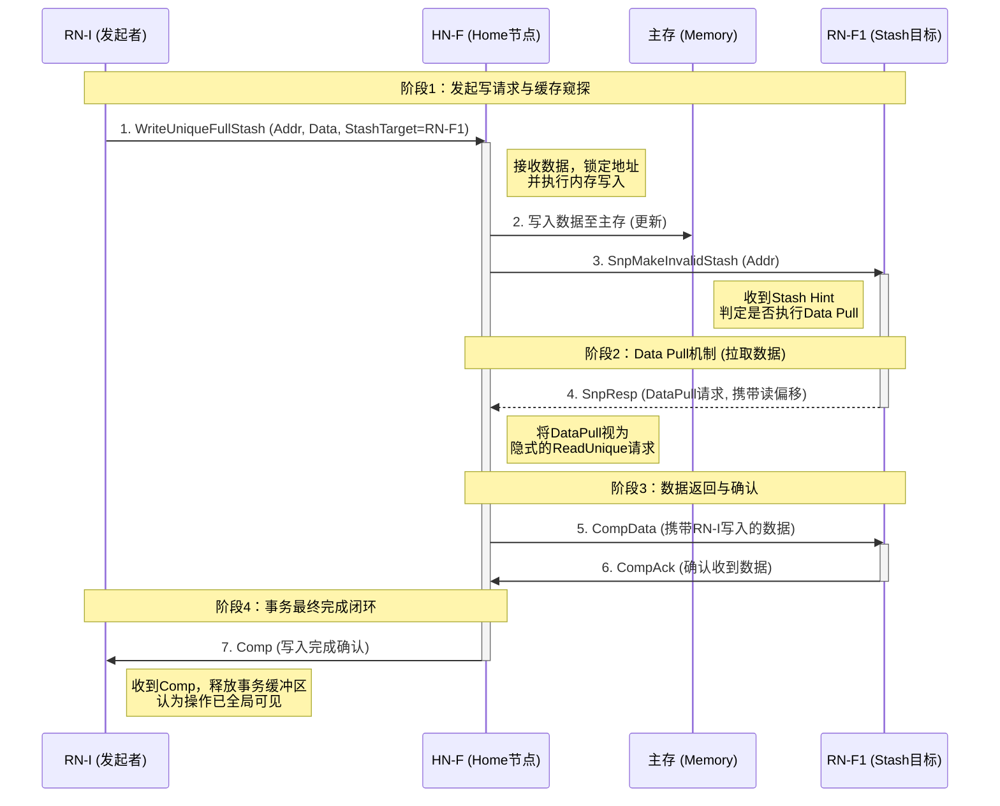

**1. 关于RN-I的响应步骤7**

- HN-F必须在数据安全落盘（步骤2完成）、且目标缓存响应处理完毕（收到步骤6的CompAck）之后，向RN-I发送Comp响应
- RN-I只有收到这个Comp,才确认该笔WriteUniqueFullStash事务已经在全局范围内完成（内存更新，且stash目标已拿到最新数据）

**2. Comp响应的发送时机细节**

- 实际上，处于性能优化，HN-F不必等待步骤6的CompAck才发Comp给RN-I
- 更常见的实现是：HN-F在完成步骤2(内存写入)后，就可以立即向RN-I发送Comp（无需等待RN-F1的数据拉取完成）。因为对于发起者RN-I来说，它的“写内存”使命在数据落盘时即已完成，后续的Stash（缓存预取）是额外的性能优化动作，不应阻塞RN-I
- 实际芯片设计通常会采用“内存写入即响应”的优化策略以降低延迟

### 6.6.2 WriteUniquePtlStash

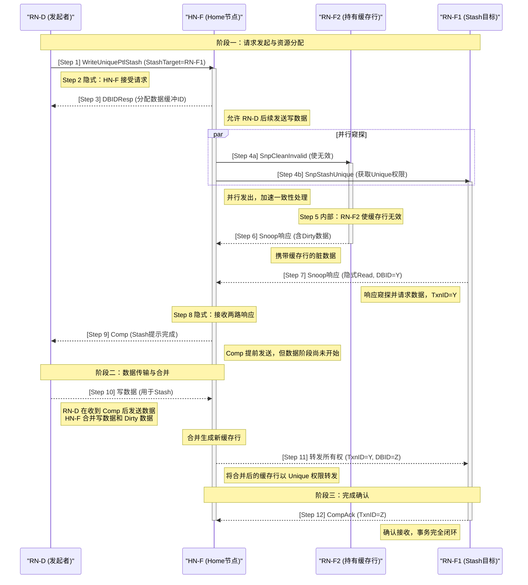

本流程展示 `WriteUniquePtlStash` 事务，发起方 RN‑D 将数据写入目标缓存 RN‑F1，同时另一个缓存 RN‑F2 当前持有该缓存行。具体顺序如下：

1. RN‑D 向 HN‑F 发送 `WriteUniquePtlStash`，StashTarget 为 RN‑F1。
2. HN‑F 接受请求（隐式）。
3. HN‑F 返回 `DBIDResp` 给 RN‑D（分配数据缓冲 ID）。
4. HN‑F **并行**发出窥探：
   - 向 RN‑F2 发送 `SnpCleanInvalid`（因持有缓存行）；
   - 向 RN‑F1 发送 `SnpStashUnique`（目标 Stash）。
5. RN‑F2 内部使缓存行无效。
6. RN‑F2 返回 Snoop 响应（含 Dirty 数据）给 HN‑F。
7. RN‑F1 返回 Snoop 响应（带隐式 Read 请求，DBID=Y，表示TxnID）。
8. HN‑F 接收两个响应（隐式）。
9. HN‑F 向 RN‑D 发送 `Completion` 响应（Stash 提示部分完成）。
10. RN‑D 向 HN‑F 发送写数据（用于 Stash）。HN‑F 将写数据与 Dirty 数据合并生成新缓存行。
11. HN‑F 将缓存行所有权转发给 RN‑F1，携带 TxnID=Y 和 DBID=Z。
12. RN‑F1 向 HN‑F 发送 `CompAck`（TxnID=Z），事务闭环。

### 6.6.3 StashOnceUnique基本流程

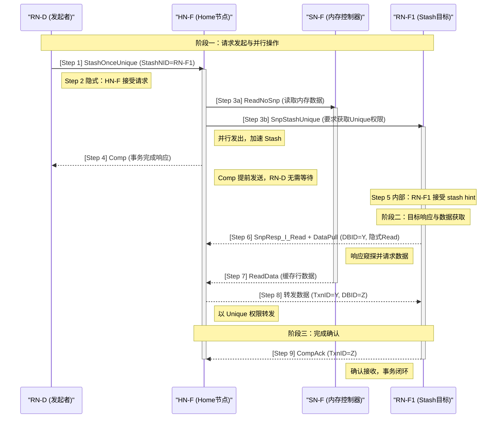

1. RN‑D 向 HN‑F 发送 `StashOnceUnique` 请求，并指定 StashNID 指向 RN‑F1。
2. HN‑F 接受该请求（事务开始）。
3. HN‑F 同时并行发出两条请求：
   - 向 SN‑F 发送 `ReadNoSnp`（读取内存数据）；
   - 向 RN‑F1 发送 `SnpStashUnique` 窥探（要求目标缓存获得 Unique 权限）。
4. HN‑F 立即向 RN‑D 返回 `Completion` 响应（表示事务已被接受，不等待数据）。
5. RN‑F1 接受 stash hint（内部确认）。
6. RN‑F1 响应 `SnpStashUnique`，返回 `SnpResp_I_Read` 并附带 `DataPull` 请求（隐式读请求），并将本次数据事务的 ID 设为 Y。
7. SN‑F 将缓存行数据返回给 HN‑F。
8. HN‑F 将数据转发给 RN‑F1，携带 TxnID=Y 和 DBID=Z。
9. RN‑F1 向 HN‑F 发送 `Completion Acknowledge`（CompAck），TxnID=Z，确认数据接收完成。

### 6.6.4 StashOnceShared基本流程

1. The RN-I issues a StashOnceShared Request to the HN-F. The StashNIDValid field is set to 0 to target the HN-F. 
2. The HN-F issues a ReadNoSnp Request to Main Memory to get the specified cache line. 
3. Main Memory returns the cache line to the HN-F. 
4. The HN-F allocates the cache line into its cache.


## 6.7 Stash的可靠性保证

如果系统中发生了Silent Cache State Transition(比图RN-B私自将缓存行状态从UC改为I，未通知HN)，而HN的Snoop Filter还认为RN-B持有UC副本，此时HN会正常向RN-B发起SnpUniqueStash，但RN-B会回复SnpResp_I(表示“我没有这个数据”)，HN收到后终止暂存优化，退回到普通的WriteUnique路径，重新收集数据并写入LLC/DRAM。**此时暂存失败，但一致性仍然正确，只是损失了带宽优化**


# 7. IO Deallocation(I/O释放分配)

I/O Deallocation（I/O释放分配）是一组特殊的读操作，允许一个RN(通常是I/O设备)在读取数据的同时，向系统提示它希望如何处理这些数据在缓存中的状态，核心目的是**避免缓存污染**

1. 核心问题

- 传统上，CPU从内存读取数据后，数据会被缓存下来，因为CPU很可能再次访问它，这是时间局部性原理
- 但I/O设备（如DMA引擎、网卡）读取数据通常具有流式（streaming）特征：数据量大，但只访问一次，用后即弃
- 如果这类流式数据进入CPU缓存，它会把那些本来可能被复用的“热”数据挤出去，造成缓存污染，反而降低CPU性能

**I/O Deallocation的思路：**让I/O设备在发起读请求时，可以附带一个==“清理提示”==，指示HN在完成读取后，不要将数据保留在缓存中，或者只保留一个干净的影子，从而避免污染

## 7.1 核心事务与缓存状态影响

CHI为I/O Deallocation定义了两种主要的一次性读事务（One-shot Read）

| 事务类型                 | 对脏（Dirty）缓存行的处理 | 数据最终去向                       | 风险与适用场景                                               |
| :----------------------- | :------------------------ | :--------------------------------- | :----------------------------------------------------------- |
| **ReadOnceCleanInvalid** | **写回内存** (Write Back) | 脏数据被写回主内存，数据不丢失     | **更安全**。适用于确定数据近期不用，但又希望保留最新数据在内存的场景。 |
| **ReadOnceMakeInvalid**  | **直接丢弃** (Discard)    | 脏数据被丢弃，内存中保留的是旧数据 | **有数据丢失风险**。**仅能**用于能100%确定该数据将来绝对不会再被使用的场景，如I/O流式数据，以节省一次写回带宽。 |

> [!IMPORTANT]
>
> - ReadOnceMakeInvalid 的关键在于它不写回脏数据。如果其他核心的缓存中有脏数据（修改过但未写回内存），这个操作会直接丢弃它，不做merge。这意味着请求者拿到的是内存中的旧数据！
> -  ReadOnceCleanInvalid则会保证脏数据被写回，请求者拿到的是合并后的最新数据，但所有副本同样被清出缓存。

## 7.2 与Eviction事务的配合

配合I/O Deallocation的还有**Eviction(逐出)**事务：

| 事务               | 作用                                                        | 数据内容                  |
| ------------------ | ----------------------------------------------------------- | ------------------------- |
| **WriteEvictFull** | 将 UC（Unique Clean）缓存行直接逐出，告诉 HN “我不再持有它” | 无数据（Clean，无需写回） |
| **WriteCleanFull** | 将脏数据写回内存，并将缓存行变成无效                        | 带数据                    |

场景：

- I/O设备读完数据后，如果它想主动释放该缓存行，保持缓存干净，可以使用Eviction事务显式逐出
- 这比被动等待缓存替换算法踢出更直接、更实时

## 7.2 提示性 vs 强制性

与Cache Stashing类似，I/O Deallocation请求中的“释放”语义本质上是提示（hint）, HN或者其他RN在收到相关snoop时，可以选择忽略该提示

- ReadOnce末尾的不缓存是提示，不是强制。请求者承诺自己不会保留，但其他缓存是否保留由HN决定
- 但ReadOnceMakeInvalid的“使所有其他副本无效“部分是强制的，否则无法保证数据最新

## 7.3 示例

### 7.3.1 ReadOnceCleanInvalid

1. RN-I发送ReadOnceCleanInvalid事务到HN-F
2. HN-F发送SnpUnique请求到RN-F，请求cacheline
3. RN-F无效cacheline并且发送脏数据给HN-F
4. HN-F将收到的数据返回给RN-I，并且将数据写回到主存，使数据保持干净状态

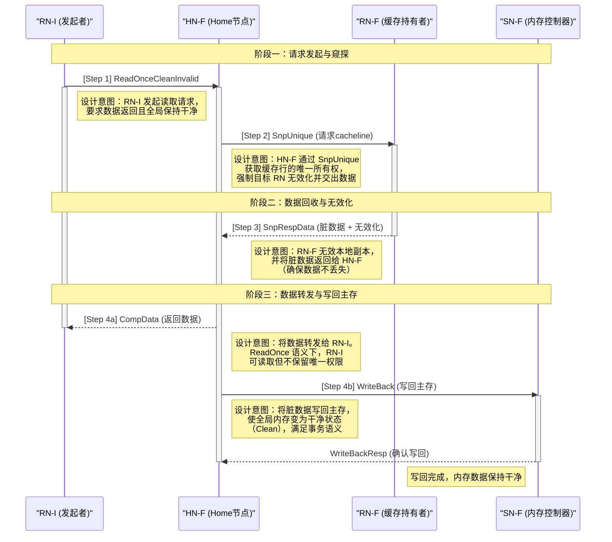

### 7.3.2 ReadOnceMakeInvalid

1. RN-I发送ReadOnceMakeInvalid事务到HN-F
2. HN-F发送SnpUnique请求到RN-F，请求cacheline
3. RN-F无效cacheline并且发送脏数据给HN-F
4. HN-F将收到的数据返回给RN-I，并且将数据丢弃

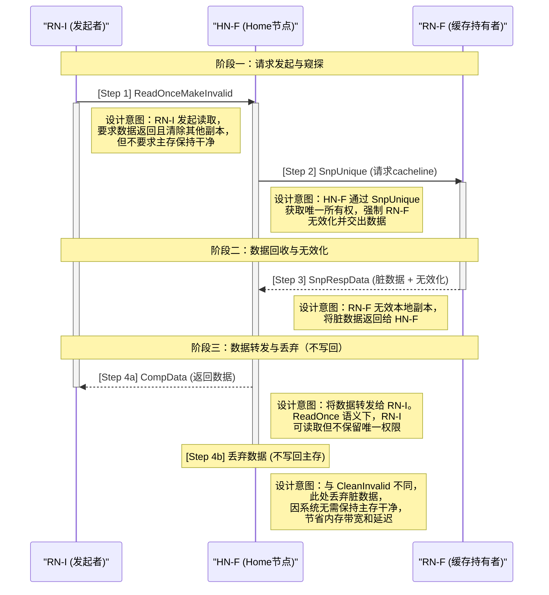


# 8. DMT、DCT、PrefetchTgt、DWT

1. 在标准的CHI事务中，数据通常需要经过Home Node(HN)中转，这会增加延迟和互连功耗。CHI-B引入了四种“数据抄近路”的技术，让数据在组件之间直接传输，跳过不必要的中转站。
2. CHI-B为此在request、snoop和data flit中增加了额外的标识符字段，用于正确路由数据到最终目标

| 类别      | SN → RN                                                      | RN → RN                                                      |
| :-------- | :----------------------------------------------------------- | :----------------------------------------------------------- |
| **CHI‑A** | Read data from the SN must pass through the HN on the way back to the RN | Snoop data from an RN must pass through the HN on the way back to the RN |
| **CHI‑B** | Direct Memory Transfer (DMT): SN data bypasses the HN and goes directly to the RN | Direct Cache Transfer (DCT): RN data bypasses the HN and goes directly to the RN |

**HN 仍然需要一个 CompAck 通知，说明 DMT 或 DCT 已完成**


## 8.1 DMT（直接内存传输）

DMT（Direct Memory Transfer）允许Suboridinate节点（SN-F）在返回读数据时，绕过HN-F，直接将数据发送给发起请求的requester

**无DMT流程：**

1. CPU向HN-F发出读请求
2. HN-F缓存未命中，向内存控制器发出读请求
3. 内存控制器获取数据，发送回HN-F
4. HN-F将数据返回给CPU——数据经过HN-F中转

**有DMT流程：**

1. CPU向HN-F发出读请求
2. HN-F缓存未命中，向内存控制器发出读请求
3. 内存控制器获取数据
4. 内存控制器直接将数据发送给发起请求的CPU，同时通知HN-F事务完成——数据跳过HN-F直传

**支持DMT的条件：**

大多数读请求可以使用DMT，包括cache stashing操作产生的隐式DataPull读，但以下情况不能使用DMT：

- Exclusive Accesses(独占访问)
- ReadNoSnp请求，且ExpComAck=0且Order!=0
- ReadOnce请求，且ExpComAck=0且Order!=0

**DMT新增标识符字段：**

- request flit : 增加ReturnNID(Return Node ID,接收数据的节点ID)和ReturnTxnID(原始请求的事务ID)
- Data Flit：增加HomeNid(home Node ID),用于通知HN哪个事务已完成

### 8.1.1 DMT传输流

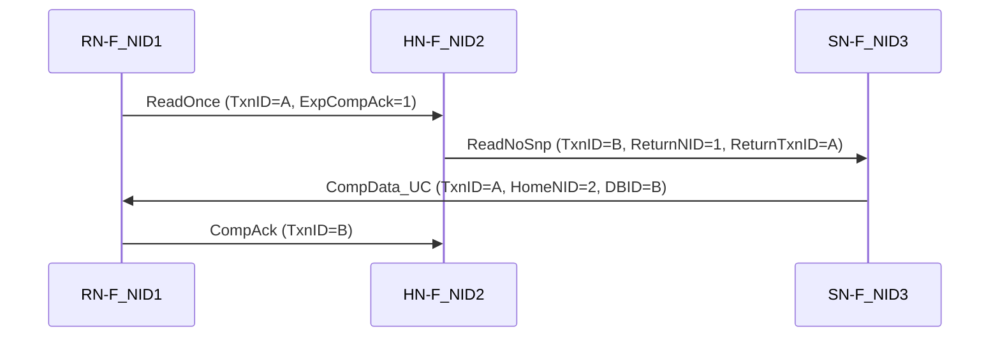

1. The RN-F sends a ReadOnce Request to the HN-F with TxnID = A and ExpCompAck = 1 

2. The HN-F does not have the requested data in its cache, so it issues a ReadNoSnp Request to the SN-F. The ReadNoSnp Request has:
   - TxnID = B 
   - ReturnNID = 1. This indicates that the read data should be sent to the RN-F, which has Node ID 1  
   - ReturnTxnID = A. This matches the TxnID from the original ReadOnce Request.

3. When the SN-F is ready to return the read data, it sends a CompData_UC message with: 
   - TxnID = A. This matches the value the SN-F received as ReturnTxnID
   -  HomeNID = 2. This is the Node ID of the HN-F
   - DBID = B. This matches the TxnID of the ReadNoSnp sent by the HN-F

4. The RN-F sends the CompAck message to the HN-F with TxnID = B. This matches the DBID field in the CompData_UC message. 

5. The HN-F receives the CompAck and can stop tracking the ReadNoSnp message it had sent to the SN-F.

### 8.1.2 优化的DMT序列—ReadOnce传输

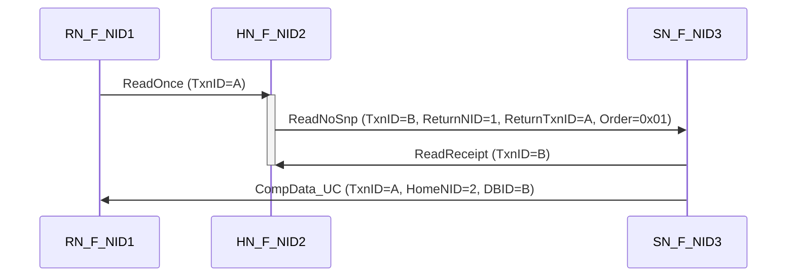

1. The RN-F issues a ReadOnce Request to the HN-F with TxnID = A.
2. The HN-F issues a ReadNoSnp Request to the SN-F with:
   - Order = 0x01
   - TxnID = B
3. The ReturnNID field gets the Node ID of the RN-F.
4. The ReturnTxnID field gets the TxnID of the original ReadOnce Request.
5. The SN-F accepts the transaction.
6. The SN-F issues a ReadReceipt to the HN-F.
7. When the data is ready, the SN-F sends the read data to the RN-F using the original TxnID.

**HN-F 收到已读回执ReadReceipt后会立即释放请求。这种释放减少了交易在 HN-F 的存在时间，从而腾出了资源。**CHI-A中，HN-F 需要等到收到 RN-F 的 CompAck 响应后，才能停止跟踪 ReadNoSnp 事务

## 8.2 DCT（直接缓存传输）

DCT（Direct Cache Transfer）允许一个对等RN-F在响应Snoop时，直接将脏数据或共享数据转发给发起请求的Requester，而不经过HN-F中转

**无DCT流程：**

RN-F0持有脏数据=》返回给HN-F=》HN-F转发给RN-F1

**有DCT流程：**

RN-F0持有脏数据=》直接发送给RN-F1，同时通知HN-F事务完成

**DCT的关键要求：**

- 数据提供者（被snoop的RN-F）必须通知HN-F它已经向请求者发送了数据
- 在某些情况下，它还必须向HN-F发送数据的副本（用于更新内存）
- HN-F仍然需要收到CompAck通知，确认DCT已完成

**DCT新增标识符字段：**

- snoop flit: 增加FwdNID(Forward Node ID)和FwdTxnID(Forward Transaction ID),告诉被snoop者数据应该发给谁（类似于DMT中的`ReturnNID`和`ReturnTxnID`）
- snoop filt中增加RetToSrc字段，为1时表示Snoop得到的数据**不仅会发送给请求者（RN-F），也会发送一份给Home Node（HN-F）**
- 数据直传后，被snoop者需要通过Response告知HN-F “我已经发了数据”

### 8.2.1 Transaction flow of DCT流程（一）


1. RN-F_NID1发送ReadNotSharedDirty请求到HN-F，请求TxnID=A
2. 该请求在HN-F是cache miss
3. HN-F发送一个SnpNotSharedDirtyFwd snoop到RN-F_NID2
   - TxnID = B
   - FwdNID = 1 , 表示RN-F_NID1，snoop data的目的地是RN-F_NID1
   - FwdTxnID = A,表示原始读请求中的的TxnID
   - RetToSrc = 0
4. 因为RetToSrc = 0，RN-F_NID2以SnpRespFwded消息响应HN-F，两个重要的字段：
   - RESP显示cache line状态从Unique Clean到Shared Clean
   - FwdState告诉HN-F，cache状态发送给了原始请求者，本示例中是Shared Clean
5. RN-F_NID2发送一个CompData消息到RN-F_NID1：
   - TxnID=A,这是在snoop request中的FwdTxnID值
   - HomeNID = 3,这是HN-F的node id
   - DBID = B,这是snoop请求中的TxnID
   - RESP = SC,表示数据是以SC状态提供的，匹配snoop响应中的FwdState字段值
6. RN-F_NID1发送CompAck消息到HN-F，携带TxnID=B,结束了ReadNotSharedDirty请求

### 8.2.2 Transaction flow of DCT流程（二）

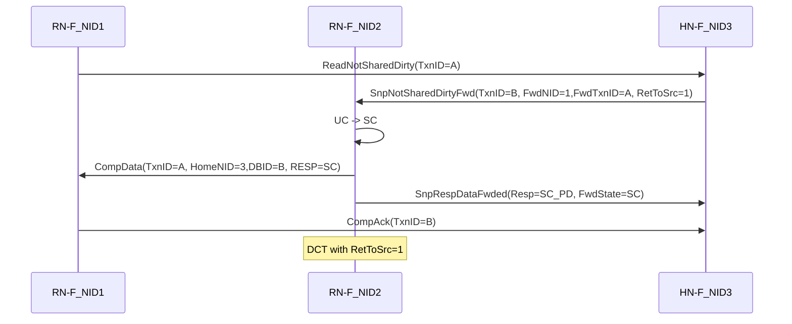

1. RN-F_NID1发送ReadNotSharedDirty请求到HN-F，请求TxnID=A
2. 该请求在HN-F是cache miss
3. HN-F发送一个SnpNotSharedDirtyFwd snoop到RN-F_NID2
   - TxnID = B
   - FwdNID = 1 , 表示RN-F_NID1，snoop data的目的地是RN-F_NID1
   - FwdTxnID = A,表示原始读请求中的的TxnID
   - RetToSrc = 1
4. 因为RetToSrc = 1，RN-F_NID2以SnpRespDataFwded消息响应HN-F，两个重要的字段：
   - RESP=SC_PD(sHARED Clean Pass Dirty)。RESP 中的这个值告诉 HN-F，缓存行在 RN-F2 上处于共享干净（Shared Clean）状态，并且 RN-F2 正将该缓存行的写回责任传递给 HN-F。
   - FwdState告诉HN-F，cache状态发送给了原始请求者，本示例中是Shared Clean
5. RN-F_NID2发送一个CompData消息到RN-F_NID1：
   - TxnID=A,这是在snoop request中的FwdTxnID值
   - HomeNID = 3,这是HN-F的node id
   - DBID = B,这是snoop请求中的TxnID
   - RESP = SC,表示数据是以SC状态提供的，匹配snoop响应中的FwdState字段值
6. RN-F_NID1发送CompAck消息到HN-F，携带TxnID=B,结束了ReadNotSharedDirty请求

## 8.3 PrefetchTgt(预取目标)

PrefetchTgt(prefetch target)是一种无数据返回的预取提示事务，直接从RN-F发送到SN-F

**核心机制：**

1. RN-F向SN-F发出prefetchTgt请求
2. 该请求不需要返回任何数据
3. 内存控制器可以将此作为提示（hint）,提前将目标数据预取到内部缓冲区中
4. 如果后续收到对该地址的正常读请求，且数据仍在缓冲区中，则可以显著加速访问
5. 由于不需要响应，PrefetchTgt中的TxnID字段不适用，CHI-B要求在发送请求时将其设置为0
6. 为了避免PrefetchTgt请求造成拥塞，CHI-B使用数据flit中的DataSource字段报告PrefetchTgt的有效性。这个字段由内存控制器设置，用来指示读取的数据是否从先前的PrefetchTgt中受益
   - 0x6 ：PrefetchTgt请求有效
   - 0x7 :   PrefetchTgt无效 

**基本流程**：

1. The CPU issues a PrefetchTgt hint to the DDR controller.

2. The DDR controller accepts the hint and begins the process of retrieving the data

3. Two things happen in parallel: 

   • The CPU issues a Read Request to the HN-F for the same address the PrefetchTgt was for. 

   • The DDR controller starts receiving the read data and buffers it for a subsequent read.

4. The CPU issues a Read Request which is sent to the HN-F
5. The Read Request results in a cache miss at the HN-F
6.  The HN-F issues a Read Request to DDR memory
7.  Because the data has already been buffered at the DDR controller, the DDR immediately returns the read data to the CPU. By using the PrefetchTgt Request, the DMT Read Transaction has almost no latency in the DDR memory access.

> [!NOTE]
>
> 通常 ，RN只会实现 RN 系统地址映射（RN SAM）。这个 SAM 面向 HN-Fs，并且不会识别 SN-F 节点 ID。为了支持 PrefetchTgt 事务，RNs 也需要一个 HN 系统地址映射。HN SAM 会将地址转换为 SN-F TgtID

## 8.4 DWT(直接写数传输)

- DWT （Direct Write-data Transfer）允许发起写请求的节点直接将写数据发送给最终目标（SN-F），而不是先发给HN-F再由HN-F转发

- 直接写入传输（DWT），在 CHI-E 中引入，是直接内存传输（DMT）的写入对应方式。

**无DWT流程：**

RN-F=>HN-F（发送写请求和数据）=》HN-F=》SN-F（转发数据）

**有DWT流程：**

- RN-F=》HN-F（发送写请求）
- **RN-F=》SN-F（写数据直接发送给SN-F）**
- HN-F只需要处理请求的排序和一致性，不需要中转数据

**适用于RN的请求类型**

- WriteUnique*
- WriteNoSnp*

`DoDWT `位被添加到与 REQ.SnpAttr 共享的 WriteNoSnp* 请求中。这仅适用于从 HN 到 SN 的 WriteNoSnp 请求

这种方式在写入大数据块时特别有效，显著降低了HN-F的数据带宽压力和互连功耗

**流程图：**

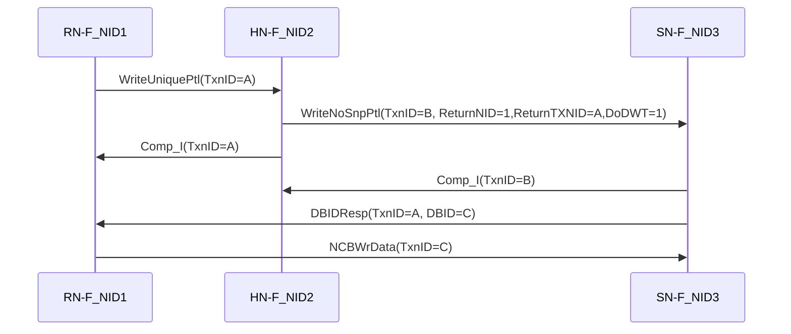


# 9. Atomic Operations(原子操作)

现代多核系统有一个核心痛点：多个核心同时争抢修改同一个内存位置（比如自旋锁、计数器）时，如何保证操作不被打断？

## 9.1 原子事务

在传统架构（如AXI3/4或CHI-A）中，要实现原子操作（如“读取-修改-写回”），请求者必须先获取数据的独占权exclusive access，把数据搬到本地cache，执行运算，然后再写回内存。这种方式存在严重弊端：

1. 数据搬运浪费带宽：为了改一个8字节的计数器，可能要搬运整个64字节的cache line来回跑
2. 长时间锁定数据：在读和写之间的窗口期内，其他代理无法访问该数据，造成系统阻塞
3. 延迟不确定：由于中间可能被其他事务打断或重试，延迟难以预测

CHI-B引入的原子事务将“读-修改-写”操作打包成一个不可分隔的单元，直接发送到靠近数据所在位置（HN或SN）的ALU单元去执行。这种“数据不动，代码动”的设计思想，大幅提升了效率并减少了阻塞时间

**核心优势：**

- 操作在目标节点集中执行，避免了数据在多组件间来回搬运
- 延迟更可预测、更准确
- 对目标内存位置的阻塞时间缩短
- 在序列化点或一致性点仲裁，简化了公平性实现

## 9.2 Near Atomic vs Far Atomic

| 类型                        | 场景                                   | 是否发出Atomic Transaction       |
| --------------------------- | -------------------------------------- | -------------------------------- |
| **Near Atomic（近端原子）** | CPU已经独占该Cache Line                | **不发出**，直接在本地ALU执行    |
| **Far Atomic（远端原子）**  | 数据在远端内存/其他核Cache中，多核在抢 | **发出**Atomic Transaction给互连 |

## 9.3 四种原子事务类型总览

CHI定义了四种原子事务，其根本区别在于是否将操作前的旧值返回给请求者

| 事务类型          | 数据流                                 | 是否返回旧值 | 支持操作          | 数据大小（出/入）          |
| ----------------- | -------------------------------------- | ------------ | ----------------- | -------------------------- |
| **AtomicStore**   | 请求者 → TxnData → 目标                | 否           | 8种算术/位操作    | 1/2/4/8字节 / -            |
| **AtomicLoad**    | 请求者 → TxnData → 目标                | 是（原始值） | 8种算术/位操作    | 1/2/4/8字节 / 同出站       |
| **AtomicSwap**    | 请求者 → SwapData → 目标               | 是（原始值） | 1种（无条件交换） | 1/2/4/8字节 / 同出站       |
| **AtomicCompare** | 请求者 → CompareData + SwapData → 目标 | 是（原始值） | 1种（比较并交换） | 2/4/8/16/32字节 / 出站一半 |

<!--注： 数据大小中“出站”指请求发送的数据大小，入站指响应返回的数据大小--> 

### 9.3.1 AtomicStore(只发不收)

AtomicStore是最简单的原子事务，请求者发送一个包含地址、操作类型（subopcode）和操作数（TxnData）的请求。目标节点的ALU使用TxnData和当前内存中的数据（AddrData）作为操作数执行运算，将结果存回内存

**特点：**

- 不返回任何数据给请求者，只返回完成响应
- 适用于不需要知道旧结果的场景，如计数器自增
- 支持8中subopcode，其中部分是条件操作（SMAX、SMIN），条件不满足时不写内存

### 9.3.2 AtomicLoad(发数据，收旧值)

1. AtomicLoad与AtomicStore机制几乎相同，同样支持8种subopcode并在条件通过时更新内存。唯一区别是：AtomicLoad会将原始的AddrData值返回给请求者
2. 适用场景：Fetch-and-Add逻辑，即“取回旧值并更新”的原子操作

### 9.3.3 AtomicSwap(无条件交换)

AtomicSwap不执行subopcode运算，而是无条件地将请求者提供的TxnData与目标地址的数据进行交换

- 新数据写入内存
- 原始数据返回给请求者

### 9.3.4 AtomicCompare(CAS,比较并交换)

这是最复杂也是最重要的事务，是实现无锁队列、信号量的核心原语

**工作机制：**

1. 请求者发送两个数据：CompareValue(比较值)和SwapValue(交换值)
2. ALU取当前内存数据与CompareValue比较
3. 如果相等：内存位置更新为SwapValue
4. 如果不等：内存不更新
5. 无论比较结果如何，原始的AddrData都返回给请求者

> [!IMPORTANT]
>
> 原子事务的响应不会告知条件操作是否成功执行。如果请求者想知道，只能通过返回的原始数据自行计算判断，或者事务完成后再发一次普通读请求

## 9.4 AtomicStore和AtomicLoad的8种Subopcode

| Subopcode              | 运算                          | 更新条件 |
| ---------------------- | ----------------------------- | -------- |
| **ADD**                | TxnData + AddrData            | 无条件   |
| **CLR**（位清除）      | AddrData & ~TxnData           | 无条件   |
| **EOR**（异或）        | AddrData ^ TxnData            | 无条件   |
| **SET**（位置位）      | AddrData \| TxnData           | 无条件   |
| **SMAX**（有符号最大） | TxnData > (signed) AddrData   | 条件     |
| **SMIN**（有符号最小） | TxnData < (signed) AddrData   | 条件     |
| **UMAX**（无符号最大） | TxnData > (unsigned) AddrData | 条件     |
| **UMIN**（无符号最小） | TxnData < (unsigned) AddrData | 条件     |

前4个是无条件操作（ADD/CLR/EOR/SET），后4个是条件操作（MAX/MIN系列），条件不满足时不更新内存

## 9.5 执行位置与硬件支持

要执行原子操作，目标需要一个算术逻辑单元（ALU）。也就是说，要使用原子操作，一个 HN、SN 或两者都需要有 ALU。从 CHI-B 开始，原子事务支持是可选的，所以 HN 和 SN 并不总是必须有 ALU。请求者有一个配置引脚，BROADCASTATOMIC，可以用来阻止请求者在下游系统不支持原子事务时生成原子事务。

原子操作在哪里执行？这取决于系统设计：

**HN-F节点（完全支持）**

HN-F作为PoC/PoS，是处理原子请求的核心节点。对于**可缓存原子操作**，HN-F会先发起Snoop获取最新Cache Line，再执行原子运算；对于**非可缓存原子操作**，HN-F采用"读-修改-写"流程：从SN读取数据、在HN-F内部执行运算、再写回SN。

**RN-F的硬件特性**

RN-F作为**全一致性请求节点（Fully Coherent Request Node）**，其核心硬件特征是包含硬件一致性cache。这使得RN-F在原子操作中扮演双重角色——既是原子事务的发起者，也是被Snoop的目标节点。

**SN节点**

SN本身**不处理**原子请求，所有原子性由HN-F保证，这样设计减少了对内存控制器的改动需求。

**HN-I节点**

HN-I**不支持**原子操作，收到原子请求会返回错误响应。

**RN-I/RN-D节点**

通过ACE5-Lite/AXI5转换支持原子操作，配有专用的**原子读数据缓冲**。需要注意：所有原子操作的写选通信号必须全置位，不支持稀疏写选通。

## 9.6 典型流程——带snoop与不带snoop

以AtomicStore为例，根据目标数据是否被其他RN缓存，分两种流程：

**流程A：不带Snoop（数据不在任何RN的Cache中）**

```
RN-F0(请求者)          HN-F                    SN-F(内存)
    │                    │                        │
    │① AtomicStore       │                        │
    │  (Addr+Op+TxnData)│                        │
    │───────────────────►│                        │
    │                    │② 读取AddrData          │
    │                    │───────────────────────►│
    │                    │◄───────────────────────│
    │                    │③ ALU执行运算并写回     │
    │                    │───────────────────────►│
    │④ Comp(无数据)      │                        │
    │◄───────────────────│                        │
```

**流程B：带Snoop（数据在RN-F2的Cache中，状态为UD）**

```
RN-F0(请求者)    HN-F       RN-F2(持有UD)    SN-F
    │              │              │             │
    │① AtomicStore│              │             │
    │────────────►│              │             │
    │              │② SnpUnique  │             │
    │              │────────────►│             │
    │              │③ SnpRespData│             │
    │              │  (返回最新数据)            │
    │              │◄────────────│             │
    │              │  (RN-F2状态→I)            │
    │              │④ ALU执行运算              │
    │              │⑤ 写回内存  │             │
    │              │──────────────────────────►│
    │⑥ Comp        │              │             │
    │◄─────────────│              │             │
```

**关键点**：当目标数据被其他RN以UD状态缓存时，HN-F必须先发SnpUnique使该副本无效化并取回最新数据，然后才能执行原子运算。这确保了操作的原子性——在整个过程中，其他RN都无法观察到中间状态

## 9.7 数据对齐规则

原子事务对数据对齐有严格要求：

- **AtomicStore/Load/Swap**：字节地址必须按**出站数据大小**对齐
- **AtomicCompare**：字节地址必须按**入站数据大小**（即出站大小的一半）对齐。比较数据位于寻址字节位置，交换数据位于有效数据的另一半

这种对齐要求确保ALU能正确解析数据包中的CompareValue和SwapValue两个字段。

# 10. RAS feature

1. 背景 ：CHI-B版本增加RAS特性，为了支持Armv8 RAS规范，主要用于帮助错误检测和系统调试
2. 核心机制：TraceTag(追踪标记)

- TraceTag的设置位置
  - 请求节点端：RN可以在初始请求中设置traceTag
  - 互连中间节点：traceTag也可以在互连的中间节点设置。例如，可以编程互连的观察点，让其在HN-F处为法网地址A的请求设置traceTag
  - 传播效果：如果在HN-F处设置了观察点，那么在HN-F处为地址A发出的任何flits都会带有tracetag标记，即使最初从RN发往HN-F的请求并没有设置该标记

# 11. MPAM

1. MPAM(Mempry System Resource Partitioning and Monitoring)，解决多租户共享内存时，资源无法被公平、可预测地分配的问题

2. 核心机制：通过两个标识符实现

   | 标识符           | 作用                 | 类比                 |
   | ---------------- | -------------------- | -------------------- |
   | **PartID**       | 标识请求属于哪个分区 | "你是哪个租户"       |
   | **PerfMonGroup** | 分区内的性能监控子组 | "你在组里的哪个子组" |

Requester 发请求时把 MPAM 标签挂在 REQ 通道上，Home Node 和 Subordinate Node 按标签分配自己的资源。标签沿 **RN → HN → SN** 路径全程传播


# MOESI

## 五大状态定义

| 状态  | 全称                | 含义                                                         | 数据干净性    | 副本数量                     |
| ----- | ------------------- | ------------------------------------------------------------ | ------------- | ---------------------------- |
| **M** | Modified（修改态）  | 缓存行已被修改，与主存不一致，本缓存独占最新数据             | 脏（Dirty）   | 唯一                         |
| **O** | Owned（拥有态）     | 本缓存是数据所有者，持有最新脏数据，其他缓存可有共享副本，负责最终写回主存 | 脏（Dirty）   | 多副本（仅一个 O，其余为 S） |
| **E** | Exclusive（独占态） | 缓存行干净，仅本缓存持有，与主存完全一致                     | 干净（Clean） | 唯一                         |
| **S** | Shared（共享态）    | 缓存行干净，多个缓存同时持有副本，与主存一致                 | 干净（Clean） | 多副本                       |
| **I** | Invalid（无效态）   | 缓存行无效，数据不可用                                       | —             | 无有效副本                   |

## 状态转移事件说明表

| 当前状态 | 触发事件           | 下一状态 | 总线操作 / 说明                                  |
| :------- | :----------------- | :------- | :----------------------------------------------- |
| **I**    | PrRd（无其他副本） | E        | 发起 BusRd，内存返回数据，获得独占干净副本       |
| **I**    | PrRd（有其他副本） | S        | 发起 BusRd，其他缓存提供数据，获得共享干净副本   |
| **I**    | PrWr               | M        | 发起 BusRdX，获取独占脏数据（可能来自其他缓存）  |
| **S**    | PrRd               | S        | 缓存命中，无总线事务                             |
| **S**    | PrWr               | M        | 发起 BusRdX，无效所有其他副本，升级为 Modified   |
| **S**    | BusRd              | S        | 侦听读请求，可提供数据，保持 Shared              |
| **S**    | BusRdX             | I        | 侦听写互斥请求，无效自身                         |
| **S**    | BusUpgr            | I        | 侦听升级请求（由 Owned 写操作发出），无效自身    |
| **S**    | Replace            | I        | 静默替换，直接丢弃                               |
| **E**    | PrRd               | E        | 缓存命中，无总线事务                             |
| **E**    | PrWr               | M        | 命中，直接修改，无总线事务                       |
| **E**    | BusRd              | S        | 侦听读请求，提供数据，转为 Shared                |
| **E**    | BusRdX             | I        | 侦听写互斥请求，无效自身                         |
| **E**    | Replace            | I        | 静默替换，直接丢弃                               |
| **M**    | PrRd               | M        | 缓存命中，无总线事务                             |
| **M**    | PrWr               | M        | 缓存命中，无总线事务                             |
| **M**    | BusRd              | O        | 侦听读请求，提供脏数据，转为 Owned（内存不更新） |
| **M**    | BusRdX             | I        | 侦听写互斥请求，提供脏数据并无效自身             |
| **M**    | Replace / Flush    | I        | 替换时写回脏数据到内存，进入 Invalid             |
| **O**    | PrRd               | O        | 缓存命中，无总线事务                             |
| **O**    | PrWr               | M        | 发起 BusUpgr 无效所有 Shared 副本，转为 Modified |
| **O**    | BusRd              | O        | 侦听读请求，提供脏数据，保持 Owned               |
| **O**    | BusRdX             | I        | 侦听写互斥请求，提供脏数据并无效自身             |
| **O**    | Replace / Flush    | I        | 替换时写回脏数据到内存，进入 Invalid             |

## 状态转移图

```
                     ┌──────────────────────────────────┐
                     │          PrWr / BusUpgr          │
                     │  (本地写，发送升级请求到总线)     │
                     ▼                                  │
                ┌───────┐        PrWr / -               │
                │       │  (本地写命中，无需总线操作)    │
    ┌──────────►│   M   │───────────────────────────────┘
    │           │       │
    │           └───┬───┘
    │               │
    │               │ BusRd / Flush
    │               │ (侦听到读请求，提供数据)
    │               ▼
    │           ┌───────┐
    │           │       │
    │           │   O   │◄──────────────────────────────┐
    │           │       │                               │
    │           └───┬───┘                               │
    │               │                                   │
    │               │ BusRdX / Flush                    │
    │               │ (侦听到独占读请求，失效并提供数据) │
    │               ▼                                   │
    │           ┌───────┐        PrWr / BusRdX          │
    │           │       │  (本地写，发送独占读请求)      │
    │   ┌──────►│   S   │───────────────────────────────┘
    │   │       │       │
    │   │       └───┬───┘
    │   │           │
    │   │           │ BusRd / -
    │   │           │ (侦听到读请求，保持共享)
    │   │           │
    │   │           ▲
    │   │           │
    │   │   PrRd / BusRd    PrRd / - (无其他副本时)
    │   │   (读失效，发读请求) ┌───────────┐
    │   │                      │           │
    │   └──────────────────────┤   E       │
    │                          │           │
    │                          └─────┬─────┘
    │                                │
    │                                │ PrWr / -
    │                                │ (本地写，静默转为M)
    │                                ▼
    │                            ┌───────┐
    │                            │       │
    └────────────────────────────┤   I   │
         BusRdX / BusUpgr / -    │       │
         (侦听到写请求，失效)     └───────┘
```

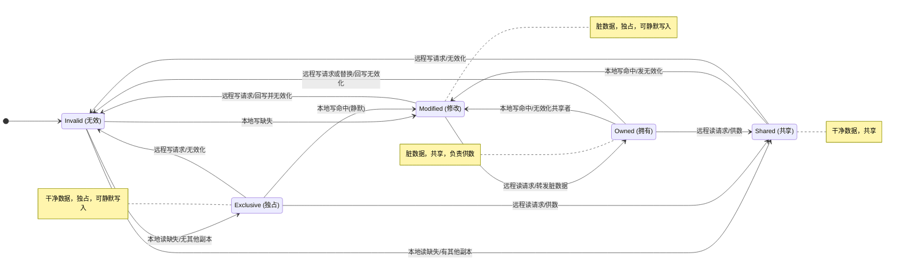

# RAQ

## CMN架构中RN和CPU之间的关系

在CMN（Coherent Mesh Network，一致性网格网络）架构中，**CPU并不是直接连接到网络上的，而是通过一个名为RN（Request Node，请求节点）的桥接节点接入网络**。

你可以把二者的关系理解为**“居民”与“物业服务中心”**的关系

。CPU核心是计算任务的执行者（居民），它产生对内存和数据的访问请求；而RN则是它在网络中的全权代理（物业），负责将这些请求标准化、管理进出流量，并代表CPU参与全系统的缓存一致性维护。

具体来说，它们之间的关系体现在以下几个方面：

**1. 角色分工：CPU是计算核心，RN是协议代理**

- **CPU的职责**：CPU内部通常包含L1（一级缓存）和L2（二级缓存）等私有缓存，它直接负责指令执行和数据处理。当一个CPU核心需要读取某个内存地址的数据时，它会先在自己的私有缓存中查找。
- **RN的职责**：当CPU在自己的缓存中未命中（Miss）时，这个读取请求并不是由CPU直接发到网络上，而是交由与之相连的**RN-F（全功能请求节点）** 来处理。RN-F会将CPU原始的读写请求转换成CMN网络能够理解的**CHI（一致性集线器接口）协议**包，然后注入到Mesh网络中

**2. 连接类型：根据CPU特性绑定特定的RN**

ARM允许不同类型的设备通过不同的RN接入，对于CPU，通常绑定的是功能最强的**RN-F**：

- **RN-F（全功能请求节点）**：这是CPU集群的专属连接节点。因为CPU拥有完整的私有缓存，且需要与其他CPU保持严格的缓存一致性，所以它需要一个“全能管家”。RN-F不仅能主动向外发起请求，还能作为**“被嗅探者”**，接收来自Home Node（HN，主节点）的监听请求，并配合完成缓存行的无效化或数据写回等复杂操作
- **代理关系**：如果CPU集群使用的是较旧的**ACE（AXI一致性扩展）协议**，RN-F内部还包含一个协议桥，负责将ACE协议转换为CMN-700内部使用的CHI协议，这进一步说明了CPU的通信完全由RN代为打理

**3. 一致性维护：RN-F是CPU的“一致性代表”**

在CHI的写无效一致性协议中，CPU的缓存一致性完全依赖于RN-F的参与：

- 当另一个CPU想要写入某个地址的数据时，负责该地址的**HN-F（全功能主节点）** 会通过查询目录，向所有可能缓存了该数据的RN-F发出**嗅探请求**。
- 与目标CPU相连的RN-F会“拦住”这个嗅探请求，并根据CPU本地缓存行的状态（是干净还是脏）代其做出响应。如果缓存行是“脏”状态，RN-F会负责将CPU缓存中的脏数据提取出来并返回，确保系统中的所有观察者看到的都是最新数据。

4. **物理设计：一体化集成与端口直连**

在实际的SoC（片上系统）设计中，CPU核和RN-F的连接极为紧密。现代ARM CPU，甚至直接将**CHI接口**实现在CPU核的内部，使其可以直接作为一个“全功能请求节点”直连到CMN的跨界点（Crosspoint）上，而无需外部协议转换。这意味着在物理或微架构层面，CPU就是RN-F实例的承载者，两者在逻辑和物理空间上都是深度融合的。

综上，在CMN网络中，**CPU是逻辑层面的“请求发起者”和“数据消费者”，而RN是物理层面的“网络接口”和“一致性管理者”**。CPU“以RN的身份”存在于网格之中，两者的关系是相互依存、职能分担的

## RN和HN中的缓存状态

【Q2】: CMN网络中缓存状态指的是RN中的缓存状态还是HN中的缓存状态，缓存状态在RN和HN中都存在吗?

【A2】: 根据CMN（Coherent Mesh Network，如Arm Neoverse CMN-700/650等）架构相关资料，缓存状态（cache state）在RN和HN中均以不同形式存在，但两者含义和所处位置不同，不能简单说“CMN网络中的缓存状态”仅指某一方。

1. 缓存状态在RN中的存在情况

- **RN-F（全一致性请求节点）**内部拥有硬件一致性缓存（如CPU核的L1/L2 cache），其缓存行会处于CHI协议定义的缓存状态（如Modified、Shared、Invalid等，或UC/UD/SC/SD/I）。
- RN-F作为请求节点，会发起读/写事务，并在自身缓存中维护对应地址的缓存状态；HN-F可通过Snoop Filter记录哪些RN-F持有某缓存行及其状态
- 而**RN-I（IO一致性）、RN-D（纯数据）**等一般不带硬件一致性缓存，或不被CMN监听，因此这类RN中不存在需CMN维护的一致性缓存状态

2. 缓存状态在HN中的存在情况

- **HN-F（全一致性Home节点）**是系统“一致性大脑”，内部通过**Snoop Filter（SF，窥探过滤器）**和**目录（Directory）**记录其管理地址范围内各缓存行的全局状态（如Exclusive/Shared/Modified）及共享者列表
- HN-F还包含**系统级缓存（SLC，末级缓存）**，SLC本身也缓存数据行，具备缓存分配与状态；同时HN-F负责PoC（一致性点）以维护多缓存间一致
- **HN-I（IO一致性Home节点）**主要做协议转换，不维护上述一致性缓存目录

3. CMN网络中“缓存状态”通常指什么

- 在CMN一致性协议语境下，当提及“缓存状态”一般**既涉及RN-F本地缓存中的行状态，也涉及HN-F中目录/SF所记录的全局缓存状态**：HN-F的目录状态用于协调跨RN的一致性（如写请求时无效化其他RN副本）；RN-F的缓存状态是真正实现数据就近访问的基础。
- 因此，**缓存状态在RN（仅RN-F类）和HN（仅HN-F类）中都存在**，并非只存在于一处。CMN采用分布式目录式一致性，HN集中记录、RN分布持有。

【Q2】RN中缓存状态更改，HN中相应的缓存行状态会同步更改吗，还是存在什么同步机制？

【A2】根据CMN/CHI一致性架构，RN（请求节点，主要指RN-F）中缓存行状态发生更改时，HN（Home节点，主要指HN-F）中相应的缓存行状态（目录/Snoop Filter记录）并不会由RN直接“同步”改写，而是通过CHI协议的事务与Snoop机制由HN集中协调更新。两者状态不是实时镜像，HN是一致性的权威管理者。

1. 基本机制：HN主导，RN不直接写HN目录

- **Snoop只能由HN发出，RN接受；RN只能发Request给HN，由HN来决定是否需要Snoop其他节点**。大部分请求都会走到HN，并由HN决定如何下发。
- RN本地缓存状态改变（如写命中升级为独占、或被Snoop置无效），通常伴随RN向HN发送请求（ReadUnique、WriteBack等）或HN向RN发Snoop，HN在事务完成时才更新自身目录里该地址的全局状态（如哪些RN持有、是Shared还是Unique Dirty）

2. 典型场景中的状态协同

- **RN写未命中/需独占**：RN发ReadUnique给HN，HN查目录发现其他RN有副本（如SC/SD），则向它们发SnpMakeInvalid；其他RN副本降为I，HN目录更新为UD/UC并返回给RN，RN本地变UD/UC。此过程HN状态由HN在收到Snoop响应和请求后集中改。
- **RN写回脏数据**：如CopyBack Write，RN发请求，HN可能Snoop验证；RN最终状态变Invalid，HN获得最新数据并更新目录。WriteCleanFull则特殊：RN发请求后状态降级为UC/SC但保留有效，HN获数据，双方状态按协议变。
- **HN发起Snoop使RN状态更改**：如CPU2写addr0，HN查目录知cpu0为SD、cpu1为SC，发Snoop干掉两者副本成I，再写回内存；结束后所有RN无副本，HN目录反映仅内存有新数据

3. 竞态与顺序保障

- HN-F对同一地址交易串行化：须收上一Snoop响应才能发下一Snoop；发Comp后须等CompAck/写回数据到达才能新Snoop，确保RN与HN状态转换“落袋”一致。
- RN收到Snoop时若自身请求未完成，须立即处理Snoop并转状态；CopyBack中Snoop无效则写回BE置0，HN以最终态更新。

4. 特殊优化：非失效型写回

- WriteEvictOrEvict中，HN可基于likelyShared选择性收/拒数据，但RN与HN缓存行最终均变Invalid；若拒收则无传输，HN目录仅标记无效。

小结

表格

| 角色 | 缓存状态更改触发            | HN是否同步改                     |
| ---- | --------------------------- | -------------------------------- |
| RN-F | 本地CPU操作 / 收HN的Snoop   | 否直接同步；HN经事务完结后改目录 |
| HN-F | 收RN请求、发Snoop、收响应后 | 自身为权威，更新全局态           |

因此，**RN缓存状态更改不自动反射到HN，而是由HN通过请求/ Snoop /响应闭环维护目录状态，保证系统级一致**
