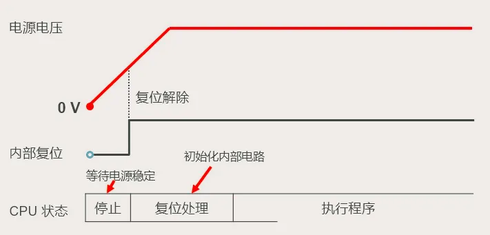
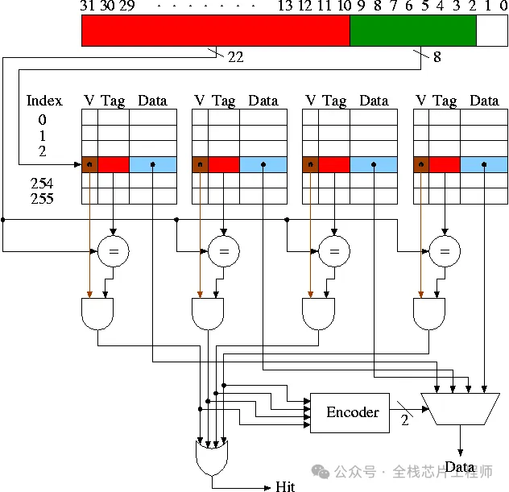

> 《芯片验证全视角经验心得分享》微信公众号
>
> [一文看懂：MCU 从上电到启动全链路](https://mp.weixin.qq.com/s?__biz=MzUzMzM1MTcwNQ==&mid=2247485482&idx=1&sn=38049c368383b075c21483db8418e0a4&chksm=fb8e4fe7b07847e908625c28e7777ccbe6b37022eaf19fe58da88539192cba111358d1a5b316&mpshare=1&scene=1&srcid=0719EeFKbAaUGsW1CklodQ1w&sharer_shareinfo=299cfaa4f413644f416f241451c4f4a7&sharer_shareinfo_first=299cfaa4f413644f416f241451c4f4a7#rd)

# 断电时

MCU断电的时候，其实处于一种“死机”的状态，所有的核心不见全躺平离线

- CPU：相当于大脑，断电瞬间直接“断片”，寄存器里的数据全丢光，跟失忆了一样，啥指令都想不起来
- RAM：跟没电的黑板似的，上面的临时变量、中间数据全被擦得一干二净
- Flash:虽然程序还在里面存着，但它就是个“哑巴”存储器，不会主动叫醒CPU
- 外设：串口、ADC这些外设也都默认关着，或者状态乱七八糟，不管你发什么指令，它们都跟没听见一样，安安静静待着，就等被重新喊醒

这时候的CPU，就是个彻头彻尾的“被动党”，硬件都在，但就是动不了，得靠外部给个“唤醒信号”才行

# 上电

当插上电源或者按下复位键，MCU内部的复位电路就开始工作了。它会盯着电源电压看，比如常用的3.3V板子，当电压慢慢爬升到大概2.8V能干活的水平时，复位电路就会给CPU发一个复位信号（通常是个电平脉冲），喊它起床。



```
【电源电压】  0V ↗↗↗↗↗↗↗──────── (稳定电压) ──────────────────────────────
                          :
                          : (电压达到阈值)
                          :
【内部复位】  ────────────┐:
                          └──────────────────────────────────────────────
                           (复位解除)

【CPU 状态】  │   停止   │       │   复位处理   │        │    执行程序    │
             └──────────┘       └──────────────┘        └────────────────┘
            (等待电源稳定)       (初始化内部电路)
```

- 因为电压上来是有个波动过程的，是从0V慢慢往上爬，中间还会有波动。如果电压还没稳就让CPU干活，CPU容易“脑子不清醒”，跑错指令，最后启动失败。`复位电路`的作用，就是等电压稳定了再喊CPU，确保启动过程顺顺利利

- 复位主要分两种：一种是自动唤醒，一种是手动唤醒。

  - 上电复位是自动的，一接通电源，电压达标后，复位电路就自动发信号，MCU就醒了，跟每天早上阳光照进房间，你自然而然醒过来一样
  - 手动复位靠复位按键触发。比如咱们调试程序时，发现程序跑错了，不用拔电源，按一下复位键，复位电路就再发一次复位信号，让MCU重新起床，相当于给MCU重启。还有设备出故障、卡住的时候，按一下复位键，也能强制MCU恢复初始状态，尝试重新启动。

  

# 复位后的1秒

1. CPU收到复位信号后，第一件事就是整理状态——把自己的工作环境恢复到出厂默认，最关键的一步，就是清空所有寄存器
2. 寄存器相当于CPU的小记事本，程序运行的时候，会临时记一些数据和指令地址。但断电之前，这个小记事本上可能还留着之前的旧笔记，要是不清空，就会影响新程序运行。所以CPU会果断清空程序计数器PC、堆栈指针SP这些寄存器，彻底忘记之前的记忆，以全新的状态准备干活。
3. 清空记事本之后，CPU接下来要做的，就是找到自己的工作起点——这就靠程序计数器PC了，它相当于CPU的导航仪，时刻指着当前要执行的指令地址。复位之后，CPU会把PC设为一个默认值，这个值就是启动的起点地址。
4. 不同厂家的MCU，起点地址不一样。比如咱们常用的STM32，起点地址是0x00000000,经典的51单片机，起点地址是0x0000，所有指令都从这里开始执行。
5. **为了防止刚醒来就被各种外设打断,这时候所有中断都是关着的**

# 启动模式选择

CPU复位之后，这时候CPU面临一个抉择：程序到底存在哪里，这就涉及到“启动模式”，通常由硬件上的BOOT引脚电平决定。

1. Flash启动（最常用）：就像从硬盘读系统。程序烧在芯片内部，断电不丢，这是量产产品的首选
2. RAM启动（调试用）：就像在内存里跑live CD。速度快，但断电就没了，开发阶段为了省去反复烧录flash的时候，会用这个模式
3. 系统存储器启动（ISP下载）：通常用来通过串口下载新程序，下完再切回flash跑

上电那一瞬间，芯片会读一下BOOT引脚是高还是低，CPU就知道该去哪个地址读程序了。以STM32为例：

1. BOOT0=0、BOOT1=0：从内部Flash启动，最常用的默认模式，平时设备正常运行都用这个；
2. BOOT0=1、BOOT1=0：从系统存储器启动，一般用来通过串口下载程序；
3. BOOT0=1、BOOT1=1：从RAM启动，调试程序专用

# 加载向量表

确定好启动模式之后，CPU直奔对应的存储器（比如flash）的起始地点，读取关键数据——向量表。用大白话来说，向量表就是一个地址清单，就像一本详细的导航手册，里面记着MCU所有关键功能的入口地址，告诉CPU接下来该往哪走：

1. 栈顶指针（SP）：告诉CPU，“bro,这块内存是你的临时储物间，东西先放这”
2. 复位中断服务程序地址：告诉CPU，“跑完这一步，马上去这个地址报道”

为啥向量表一定要放在起点地址？

因为，CPU复位后，程序计数器PC的默认值就是起始地址（比如0x00000000）,CPU一开始只会读这个地址的数据，如果向量表不在这里，CPU就找不到栈顶地址和复位中断程序地址，启动就会卡住，不知道往哪走

# 执行复位中断服务

拿到地图后，CPU跳转到“复位中断服务程序”，开始执行真正的代码：

1. 初始化RAM（搬仓库）：把flash里那些有初始值的全局变量，搬到RAM里来（因为RAM读写快）。把那些没初始值的变量，统统清零。这就把临时仓库收拾干净了。
2. 初始化堆栈（划地盘）：设置好栈区和堆区的大小。栈要是设小了，函数调用一朵就“溢出”了，板子直接死机
3. 初始化时钟（换引擎）：刚上电时，为了稳妥，用的是内部低速时钟，像个拖拉机，这时候要把它换成外部高速时钟
4. 初始化外设：按需打开串口（用来打印调试信息）、ADC（读传感器）等等。还有一个重要的叫“看门狗”，就是个定时炸弹，如果程序跑飞了没去“喂狗”（重置它），它就炸了（复位MCU），防止程序卡死
5. 跳转main:当这一切都弄利索了，最后一条指令就是跳转到咱们熟悉的main函数。

# main函数操作

启动阶段，为了让CPU专心做初始化，所有外设的中断都被关掉了。但进入main函数后，中断就成了提高效率的神器。

举个例子：串口收到数据后，触发中断，CPU立刻去处理数据，处理完再回到原来的代码，继续执行其他任务。这种方式比轮询（CPU一直问外设“你有数据 啊？有数据吗？”）高效多了——轮询会浪费cpu大量事件，而中断能让cpu忙的时候干活，闲的时候待命，响应也更快

所以进入main函数后，要根据需求，开启需要的中断：比如要接收串口数据，就开启串口中断，要用到定时器，就开启定时器中断，让MCU高效工作，不用做无用功

# 总结

MCU启动过程，其实就是三个阶段：

1. **硬件触发**：通电，复位电路叫醒CPU
2. **引导加载**：CPU读引脚、找地图（向量表），去复位程序那报道
3. **软件初始化**：搬数据、换时钟、开外设，最后跳进`main`函数