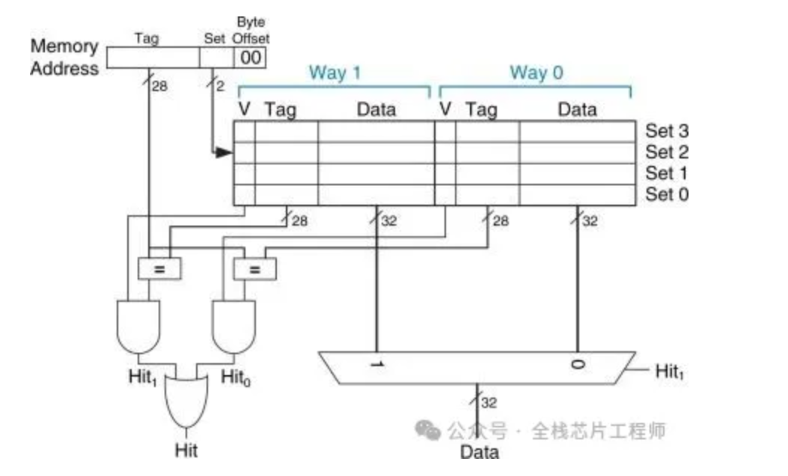

# Cache设计中，set与way配置权衡

> 《全栈芯片工程师》微信公众号
>
> [Cache设计中，Set与Way配置权衡](https://mp.weixin.qq.com/s?__biz=MzI4NjE5NTM0Ng==&mid=2247538421&idx=1&sn=6440c13b8814b080a86e5959e4731177&chksm=ea8516368e24ad0686722a1e381b3c67733e3f00c0f5c13e301d84df962ace56ddb270be201f&mpshare=1&scene=1&srcid=0719eZ8DmpR7VIwKtMwOVRcq&sharer_shareinfo=98a1647143c0a243888dd48a9db615e8&sharer_shareinfo_first=98a1647143c0a243888dd48a9db615e8#rd)

cache就是在cpu和内存之间搭了个“高速中转站”。内存里的数据要往CPU里送，如果每次都从DDR里现取，那CPU得等得直跺脚。所以搞了个SRAM做cache,把常用的数据提前搬进来

但cache容量毕竟小，内存地址那么多，怎么往里放？这就引出了set和way两个概念

> [!NOTE]
>
> 打个比方，想象你家楼下有一排快递柜，总共分成8个片区，每个片区有4个格子。快递员送包裹时，先看你的楼号，算出该放到哪个片区，然后在这个片区里挑一个空格子塞进去。这里的片区就是set，格子就是way

## set是什么

set是组，也叫索引组。cpu发出来的内存地址不是随便往cache里扔的，而是被拆成了三段：高位的tag、中间的set index、低位的offset。中间的那几位set index就像一个哈希函数，算出来一个组号，这个数据就只能落在这个组里

比如一个32KB的L1 cache，cache line size是64B,4路组相连。那么共有32KB/64B/4 = 128个set。地址里的set index就是7位（2^7=128），这7位决定了数据该进哪个组

## way是什么

way是路，也叫路数。每个set里面并列放着好几条cache line，每一条就是一个way。如果是4-way set associative，那么每个set里就有4个座位，内存里不同地址的数据，只要算出来同一个set号，都可以同时待在这个set的不同way里。

看上面这张图就很清楚，地址的set index选中了某一个set之后，这个set里面有4个way并列排开。硬件会同时拿这4个way里的tag去跟地址的高位做比较，哪个对上了，哪个就是命中（hit）。4个比较器并行工作，所以速度并不慢

## 为什么选择组相连

1. 直接映射（direct mapped）最简单，一个set只有一个way，地址算出来是几就只能放几。问题是内存里像个一定间隔的地址会撞车，不同地把对方踢出去，这叫“冲突失效”
2. 全相联（fully associative）最爽，数据可以随便放哪个cache line，没有set的限制。但代价是每次查找都要把全cache的tag比一遍，硬件复杂度和功耗都扛不住
3. 组相联（set associative）就是折中：先用set index锁定一个小范围（一个set）,再在这个小范围里并行比较几个way。既缓解了冲突，又没让硬件大膨胀

## 总结

set决定了数据该进哪个片区，way决定了这个片区里有多少个并列座位。地址先定set，再在way里找空位或替旧数据。路数越多，抗冲突能力越强，但tag比较和替换逻辑的硬件成本也越高。芯片涉及就是在面积、功耗和性能之间反复掂量，选一个合适的way数。

