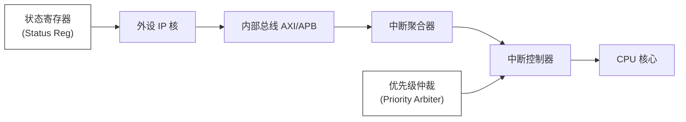

# 中断到底是怎么“打断”CPU的？

> 《路科验证》微信公众号

中断不是简单的“函数调用”，而是一套涉及信号同步、总线仲裁、特权级切换、上下文保护的精密硬件机制。理解这条链路上的每个环节，是排查“丢中断”、“响应延迟”、“嵌套异常”等疑难杂症的唯一途径

## 从物理信号开始：中断的电气本质

### 中断信号的硬件形态

在芯片内部，中断最初只是一个点评变化

| **触发方式**               | **电气特性**          | **典型应用**                    |
| -------------------------- | --------------------- | ------------------------------- |
| 电平触发 (Level-sensitive) | 持续高/低电平期间有效 | UART RX FIFO 非空、DMA 完成     |
| 边沿触发 (Edge-triggered)  | 上升沿/下降沿瞬间有效 | GPIO 按键、外部脉冲、定时器溢出 |
| 脉冲触发 (Pulse-triggered) | 特定宽度脉冲          | 高速同步信号、时钟丢失检测      |

> [!IMPORTANT]
>
> 边沿触发需要同步器（Synchronizer）处理跨时钟域（CDC）问题。如果外设时钟与CPU时钟异步，裸边沿可能因亚稳态（Metastability）丢失。这就是为什么高性能SoC会在GPIO控制器内部集成双触发器同步链

### 中断线的物理连接

现代SoC的中断连接并非“一根线直达CPU”：

flowchart LR
    A[外设 IP 核] --> B[内部总线 (AXI/APB)] --> C[中断聚合器] --> D[中断控制器] --> E[CPU 核心]

