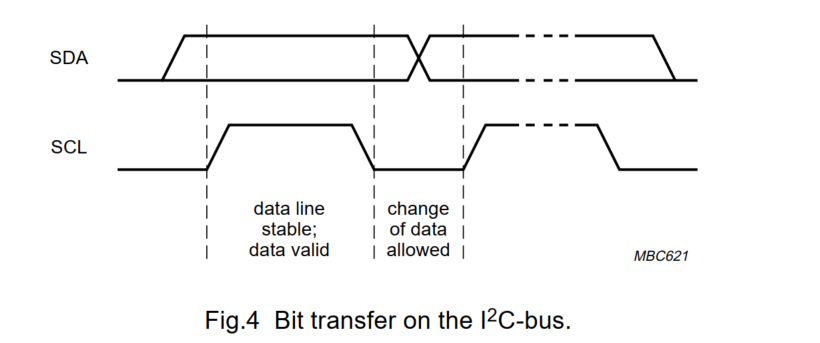
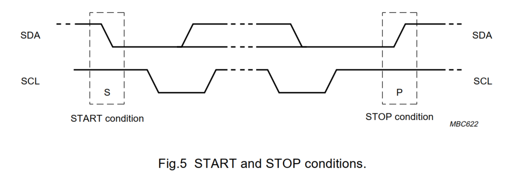
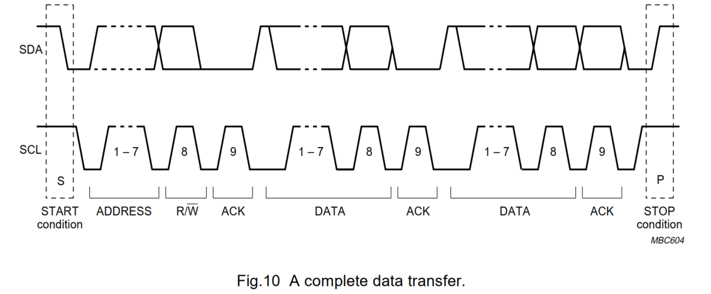
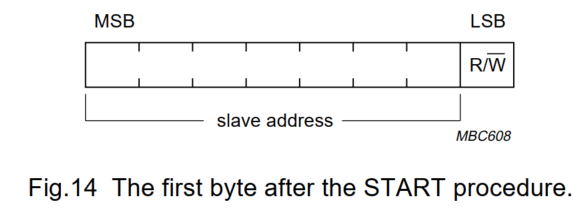
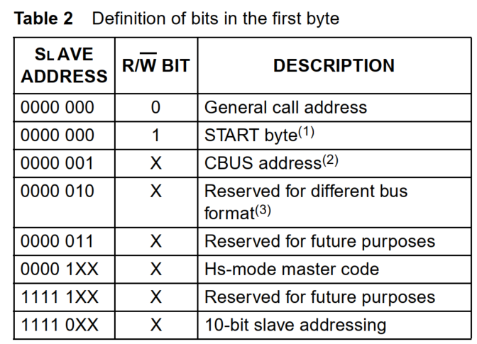
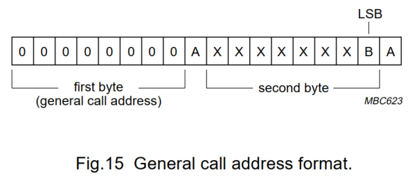
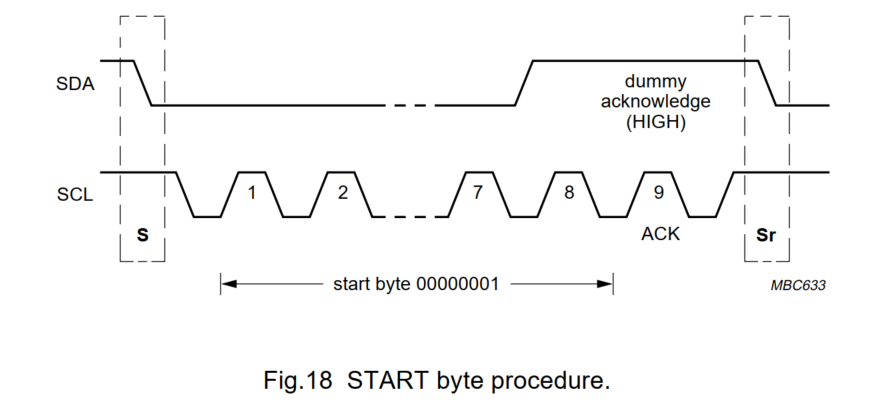

# 背景

1. 1992年发布1.1版本

2. 飞利浦公司（Philips）研发

3. 概念：I2C总线支持任何集成电路制造工艺（NMOS,CMOS,bipolar）。两根线，串行数据（SDA）和串行时钟（SCL），在连接到总线的设备之间传递信息。每个设备通过唯一的地址（无论是微控制器、LCD驱动器、内存还是键盘接口）被识别，并可以根据设备的功能作为发射器或接收器进行操作。显然，LCD驱动器仅为接收器，而内存可以接收和传输数据。除了发射器和接收器外，设备在执行数据传输时还可以被视为主设备(master)或从设备（slave）。主设备是启动总线上数据传输并生成时钟信号以允许该传输的设备，在此时，任何被寻址的设备都被视为从设备。

4. 数据传输方向和设备之间的关系：

   1） Suppose microcontroller A wants to send information to
   microcontroller B:
   • microcontroller A (master), addresses microcontroller B
   (slave)
   • microcontroller A (master-transmitter), sends data to
   microcontroller B (slave- receiver)
   • microcontroller A terminates the transfer

   2） If microcontroller A wants to receive information from

   microcontroller B:
   • microcontroller A (master) addresses microcontroller B
   (slave)
   • microcontroller A (master- receiver) receives data from
   microcontroller B (slave- transmitter)
   • microcontroller A terminates the transfer  

# 特性

- 只需要两条总线线：一条串行数据线SDA和一条串行时钟线SCL

- 每个连接到总线的设备都可以通过唯一地址进行软件寻址，并且在所有时间内都存在简单的主/从关系；主设备可以作为主发射器或主接收器操作

- 这是一种真正的多主设备总线，包括冲突检测和仲裁，以防止在两个或更多主设备同时发起数据传输时的数据损坏

- 在标准模式下，串行、8bit基础单元的双向数据传输可以以高达100kbt/s的速度进行，在快速模式下可达400kbit/s，或在高速模式下可达3.4Mbit/s

- 片上滤波可抑制总线线路上的尖峰，以保持数据完整性

  > I2C SDA/SCL容易受外界干扰产生短暂毛刺；很多I2C外设会在芯片内部集成RC滤波，不需要外接外部电阻电容，也就是on-chip filtering

- 可以连接到同一总线的设备的数量仅受最大总线电容400pF的限制

  > I2C-SDA、SCL依靠上拉电阻把总线拉高；每一颗挂载的芯片都会自带引脚寄生电容
  >
  > - 挂载的器件越多，总线上等效电容就越大
  > - 电容太大时，电平上升沿就会变得迟缓，拉高速度变慢，时序就会出错、通信失败
  > - I2C协议规定：整条总线总寄生电容不可超过400pF,因此不是总线地址数量决定挂载上限（7位地址可挂127个设备），实际硬件上限由引脚电容决定

- I2C总线上时钟信号永远由主机负责产生；每一台主机在总线传输数据时，都会生成属于自身的时钟信号。主机输出的总线时钟，只有两种情况才会被改动：

  - 一是速度较慢的从机拉低时钟线进行时钟拉伸
  - 二是多主机竞争总线、发生总线仲裁的时候，被其他主机通过线-与拉扯SCL（`详见时钟同步章节`）

  > [!NOTE]
  >
  > 1. 时钟只能由主机产出：I2C-SCL默认由当前通信的主机驱动；从机本身不会主动输出时钟
  >
  > 2. 每个多主机设备，通信时发出自己的时钟。I2C支持多主机架构，哪一个主机在线-与拉扯机制中抢到总线，就由它输出SCL时钟
  >
  > 3. 仅两类场景主机时钟会被外力强行改变：
  >
  >    - 从机时钟拉伸clock-stretching
  >
  >      低速从机来不及接收字节，就主动把SCL引脚持续拉低，强制暂停主机时钟，等自己准备就绪再释放时钟线。这是从机唯一可以干预时钟的手段
  >
  >    - 多主机中拆arbitration
  >
  >      两台及以上主机同时发起信号，会对比SDA数据线电平进行竞争；输掉仲裁的主机需要立即停止输出时钟，此时时钟就由获胜的主机接管

- SCL和SDA都是双向线路。当总线空闲时，两条线路均为高电平。

- 数据有效性：SDA线上的数据必须在时钟的高电平期间保持稳定，数据线的高电平或低电平状态只能在SCL线上的时钟信号为低电平时发生变化

  

# 启动和停止条件

在I2C总线的过程内，会出现独特的情况，这些情况被定义为开始S和停止P条件

- 启动条件：在SCL为高电平时，SDA线上的高电平到低电平的转换
- 停止条件：在SCL为高电平时，SDA线上的低电平到高电平的转换

启动和停止条件时钟由主设备生成。在启动条件之后，系统被认为是忙碌的。在停止条件之后的某段时间，系统被认为重新可用

> [!NOTE]
>
> 如果连接到总线的设备包含必要的接口硬件，则检测启动和停止条件是简单的。然而，未具备此类接口的微控制器必须在每个时钟周期至少对SDA线进行两次采用，以感知状态转换。

# 传输数据

## 字节格式

1. 放置在SDA线上的每个字节必须为8bit。每次传输的字节数没有限制。每个字节后都必须跟随一个Ack bit
2. 数据以**最高有效位(MSB)优先**的顺序进行传输。如果从设备在执行其他功能（例如处理内部中断）之前，无法接收或传输另一个完整的字节数据，它可以将时钟线SCL保持在低电平，以迫使主设备进入等待状态。数据传输在从设备准备好接收另一个字节数据并释放时钟线SCL时继续进行。

## 应答Ack

1. **带应答的数据传输是强制要求**，应答对应的时钟脉冲由主机产生，在应答时钟到来时，发送方需要释放SDA数据线，也就是让SDA变为高电平

   > [!CAUTION]
   >
   > 发送端（主机发送/从机发送）此时放开SDA，不再霸占数据线，交由接收方拉低做应答

2. 接收设备必须在应答时钟脉冲期间拉低SDA，保证SDA在该时钟的高电平阶段稳定保持低电平；同时需要满足协议规定的建立时间、保持时间时序参数

3. When a slave doesn't acknowledge the slave-address(busy 执行实时任务、无法收发数据)，SDA保持高电平。The master可以产生停止信号终止传输，或者重复起始信号开启一次新的通信 

4. 从机一开始应答成功，中途接收饱和、不能再接收数据

   if slave-receiver应答了地址，但后续无法继续接收字节；从机对接下来第一个字节返回NACK（SDA高电平）；主机发起STOP或者重复起始，终止传输

5. 主机作为接收方（读操作，从机发送数据）的应答规则

   If a master-receiver读取数据时，最后一个字节不能发出ACK，以此通知发送数据的从机：数据传输到此结束。从机发送方释放SDA,交由主机产生停止信号或者重复起始信号。

# 仲裁与时钟生成

## 时钟同步

1. I2C-SCL引脚为开漏输出、线-与（wired-AND）;多个主机各自产生独立时钟，总线SCL电平由**拉低时间最久**的主机决定，自动完成时钟同步，也是总线仲裁的基础前提。

   > wired-AND线与：开漏引脚特性，只要任意一个芯片把SCL拉低，整条总线就是低电平；所有芯片全部释放，总线才会上拉至高电平

2. I2C支持多主机；每一个主机内部都有独立时钟发生器。但多条时钟不能各自为政，必须同步成一条公共SCL时钟，多主机才可以做电平对比、逐位仲裁争夺总线

3. 低电平阶段同步逻辑：

   - 只要任意一台主机将SCL由高拉低，所有参与时钟同步的设备立刻开始计时自己时钟的低电平时间
   - 某个主机一旦把SCL拉低，就会持续锁住SCL为低，直到它自身计时结束，准备拉高
   - 即便某台主机计时完毕、想要释放SCL拉高总线，只要还有另一台主机仍处于它的低电平计时阶段，SCL依旧会被对方强行拉低
   - **总线SCL低电平时长 = 所有主机里最长的低电平时间**
   - 低电平时间较短的主机计时完成之后，只能进入高电平等待状态，等着最慢的主机结束低电平阶段

4. 高电平阶段同步逻辑

   - 等到全部主机都走完自身的低电平计时，没有设备继续拉低SCL，上拉电阻将总线抬到高电平
   - 此时所有主机检测到SCL为高，随机开始计时自己时钟的高电平时长
   - **最先跑完高电平计时的主机，会率先把SCL再次拉低**开启下一个时钟周期

## 仲裁

1. SCL、SDA同时为高代表总线空闲。主机必须先检测总线空闲，才可以拉低SDA发出START（起始信号）；总线被占用时不能发起通信

2. 多主机同时下发起始，硬件线-与机制会合并电平，总线上只会出现一个合法、确定的START时序，不会出现混乱、互相冲突的多路起始信号

3. **仲裁在SCL高电平阶段，依靠SDA数据线完成**。当一台主机发出高电平，而另一台主机正在输出低电平时，输出高电平的主机会关闭自身的数据输出电路，因为总线上的实际电平和它自己想要发送的电平并不一致。

4. 仲裁过程可能持续对比多个比特位。仲裁第一阶段会逐位比对地址位；倘若多个主机正在尝试寻址同一个从机设备，那么仲裁将会继续往下比对：若是发送型主机，就对比数据位；若是接收型主机，则比对应答ACK比特

5. 由于I2C总线上的地址、数据流全部由仲裁获胜的主机掌控，仲裁竞争全程不会发生数据丢失

6. 仲裁失败的主机，不能立刻停止SCL时钟，它需要继续输出该字节剩下所有SCL时钟脉冲，把当前这个字节完整传输结束。

   > 示例：
   >
   > - 两台主机正在发送8bit地址字节，传到第5个bit时主机A仲裁失败
   > - 主机A立刻关掉自己的SDA数据输出，不再驱动数据线
   > - 但是SCL时钟依旧正常输出，走完剩下3位时钟 + ACK应答时钟
   > - 整条总线的数据控制权交给胜出的主机B

7. 高速模式（HS-mode）主机拥有专属的8-bit主机标识码，因此仲裁一定会在**第一个字节（主机编码字节）阶段就分出胜负**。不可能拖到后面的从机地址、数据字节。一旦主机码阶段选出总线主控，后续整条高速传输期间不再做仲裁。

   > [!NOTE]
   >
   > 1. HS模式速率可达3.4Mbit/s，高速阶段本身不支持多主机仲裁
   > 2. 想要开启高速传输，主机先要以快速模式（400kHz）发送1字节代码Master-Code:`0000 1XXX`;
   > 3. 低3位XXX就是每一台高速主机独一无二的编号，一条总线最多容纳8台高速主机
   > 4. **该字节不会有从机ACK应答**，发完主机码 + NACK之后，胜出主机发出重复START，正式切到3.4M高速通信

8. 如果一台主机同时自带从机功能，并且它在寻址阶段输掉了总线仲裁；那么存在一种可能性：获胜的主机此刻正在访问它本身，因此仲裁失败的主机必须立刻切换为从机工作模式。
9. 以下情况不允许进行仲裁：
   - 重复开始条件和数据位
   - 停止条件和数据位
   - 重复开始条件和停止条件

## 将时钟同步机制用作握手

除了在仲裁程序中使用外，时钟同步机制还可以用于使接收器应对快速的数据传输，既可以在字节级别也可以在比特级别。

1. 在字节级别，设备可能能够以较快的速率接收字节速率，但需要更多时间来存储接收的字节或准备要传输的下一个字节。从设备可以在接收并确认一个字节后，然后将SCL线保持在低电平，以强制主设备进入等待状态，直到从设备准备好进行下一个字节传输，这是一种握手
2. 在bit层面，微控制器这类设备，无论自带简易I2C硬件外设或是没有硬件I2C，都能够通过拉长时钟SCL-低电平的时长，拉慢总线时钟。依靠该机制，所有主机的通信速率都会适配这台设备的内部运行速度
3. 在HS模式，握手功能只能在字节级别使用

# 9位地址格式

在启动条件（S）之后，发送从设备地址。该地址长度为7位，后面跟随第8位，即数据方向位（R/W） -- 0表示写入，1表示读取。数据传输时钟由主设备生成的停止条件P终止。然而，如果主设备仍希望在总线上进行通信，它可以生成重复开始条件Sr并在不先生成停止条件的情况下寻址另一个从设备。在这样的传输中，可以出现各种读取/写入格式的组合。

## 7位寻址

1. 当发送一个地址时，系统中的每个设备会将开始条件后面的前7bit与其地址进行比较。如果它们匹配，设备将根据R/W位将自身视为主设备作为接收器或从发送器寻址

   

2. 从设备地址可以由固定部分和可编程部分组成。由于在系统中可能会有多个相同的设备，因此从设备地址的可编程部分使得能够连接到I2C总线的此类设备的最大数量成为可能。设备的可编程地址位的数量取决于可用引脚的数量。例如，如果一个设备有4个固定地址位和3个可编程地址位，则最多可以连接8个相同的设备到同一总线。

   

   > 1. 不允许任何设备在接收到`起始字节`时进行确认
   > 2. CBUS地址已被保留以便在同一系统中实现与CBUS兼容和I2C总线兼容设备的混合使用。I2C总线兼容设备在接收到此地址时不允许响应
   > 3. 保留用于不同总线格式的地址是为了使I2C和其他协议能够混合。只有能够与这些格式和协议协同工作的I2C总线兼容设备才被允许对该地址做出响应

### 通用呼叫地址

通用呼叫地址用于寻址连接到I2C总线的每个设备。然而，如果某个设备不需要通用呼叫提供的任何数据，则可以通过不发出确认来忽略此地址。如果某个设备确实需要来自通用呼叫地址的数据，它将确认该地址并表现为从接收器。后续的字节将由每个能够处理该数据的从接收器进行确认。无法处理这些字节之一的从设备必须通过不确认来忽略它。通用呼叫地址的含义总是在第二个字节中指定。

1. bit B=0

   - 0x06（00000110）：复位 +硬件改写可编程从机地址
     - 所有支持通用广播的芯片收到[0x00 + 0x06]双字节序列后，设备硬件复位
     - 随即加载、锁存可编程部分的从机地址
     - 硬件注意事项：芯片上电瞬间不要强行拉低SDA、SCL，否则会钳位总线，阻塞全部I2C通信
   - 0x04(0x000100):仅改写可编程从机地址，设备不复位
     - 适合需要动态修改从机地址、又不想重启设备的场景；所有带硬件可编程地址、并且响应广播的器件，会锁存新地址
   - 0x0 :禁止使用，属于保留非法编码
   - 其余未定义的第二个字节编码，从机直接忽略、不执行任何操作

2. bit B=1

   适用设备：纯硬件主机（如键盘扫描器）

   特点：硬件电路固化、无法软件编程写入目标从机地址；它不清楚要把数据发给哪一颗从机，只能上电之后通过广播上报自己的身份地址，通知系统主控

   - 第二个字节：最低位B=1，高7位就是该硬件主机自身的7位从机地址
   - 系统工作逻辑一：
     - 键盘扫描器上电发出广播，上报自己的主机地址
     - 总线上的单片机（智能主控）识别该地址
     - 之后单片机接收键盘主机发来的数据
     - 如果该硬件主机也可以充当从机，它的从机地址就等于上报的7位主机地址
   - 系统工作逻辑二
     - 系统上电复位之后，硬件主机先强制设置成从机-接收器模式
     - 由系统主控主机通过I2C，预先配置它后续需要通信的目标从机地址
     - 配置完毕，硬件主机切回主机发送模式，向着指定设备传输按键数据

### 起始字节

start-byte是专门给软件模拟I2C的低速单片机做低速唤醒-高速同步的过渡机制，硬件I2C外设可以直接忽略它。

**两种单片机接入I2C总线的方式**

1. 片上自带硬件I2C外设

   硬件外设会自动监控SDA、SCL；总线有通信请求时直接触发硬件中断，CPU不用一直盯着总线，可以安心跑别的业务程序

2. 没有硬件I2C，软件轮询（GPIO模拟I2C）

   单片机只能靠程序循环不断读取SDA/SCL电平

   - 轮询越频繁，CPU占用越高，本职业务能运行的时间就越少
   - 为节省算力，软件单片机只能采用很低的采样频率扫描总线

   问题：普通短时序的START起始信号，低速采用很容易错过

   所以I2C协议定义了一套加长版启动流程，用来唤醒低速软件-I2C设备

**完整流程**

START(S)→起始字节START-byte→ACK时钟脉冲→重复起始信号Sr

1. START(S):主机先发常规起始信号
2. START-byte = 00000001 。前7位全是0，最低位为1。前7个连续的低电平，就是用来给低速轮询的单片机做提示
3. 应答时钟脉冲：仅仅只是为了遵循I2C“每发送一字节就要附带一个ACK时钟”的字节格式；**任何从机都不许应答该字节**
4. 重复起始Sr:真正正式通信的同步起始标志

### CBUS兼容性

略

# 快速模式

需要特别关注的特性：

- 快速模式设备的输入端包含了尖峰抑制和施密特触发器在SDA和SCL输入处
- 快速模式设备的输出缓冲器包含了对SDA和SCL信号下降沿的斜率控制
- 如果快速模式设备的电源关闭，SDA和SCL I/O引脚必须处于悬空状态，以免阻碍总线

# 高速模式

需要特别关注的特性：

1. 在多主设备系统中，HS模式传输器件不进行仲裁或时钟同步，这加快了比特处理能力。仲裁程序总是在F/S模式下前一个主码传输完成后结束
2. 高速模式的主机输出串行时钟，ACL高电平和低电平时长比例为1:2
   - 普通标准/快速I2C没有强制1:2
   - I2C关键时序
     - 建立时间tSU-DAT:SDA数据需要提前于SCL上升沿稳定好
     - 保持时间tHD-DAT:SCL拉高之后，SDA电平仍需要维持一段时间
   - 为什么1：2占空比可以减轻时序压力
     - SCL高电平区间很短，专门用来采样SDA
     - 拉长SCL低电平的时长，留给器件充足的时间去更新、翻转SDA数据线

# 10bit寻址

1. 10bit寻址与7bit寻址兼容，并且可以结合使用。使用10bit进行寻址利用 保留组合1111XXX用于首字节的前七位

2. 尽管保留地址位1111XXX存在八种可能的组合，但仅使用其中四种组合11110XX进行10位寻址。其余四种组合11111XX保留用于未来的I2C总线增强

3. 首字节的前7位是组合11110XX,其中最后两位XX是10位地址的两个最高有效位MSB；首字节的第8bit是决定消息方向的R/W位

4. **如果R/W位为0，则第二个字节包含10位地址的其余8位；如果R/W位为1，则下一个字节包含从设备向主机传输的数据**

   > [!IMPORTANT]
   >
   > 1. 10位地址完整匹配，永远只能在写的时候完成；读请求依靠重复起始，复用之前已经锁存完整的10位地址
   > 2. 独立读事务不允许，读必须依附前面写阶段完成完整地地址绑定
   >
   > 

